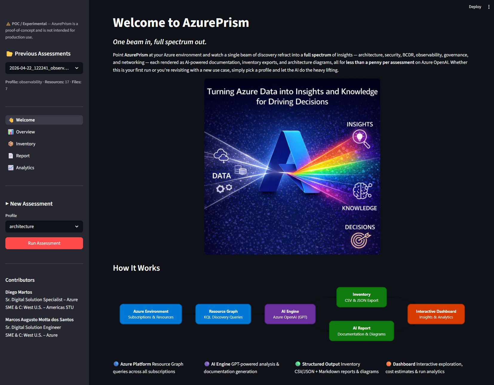
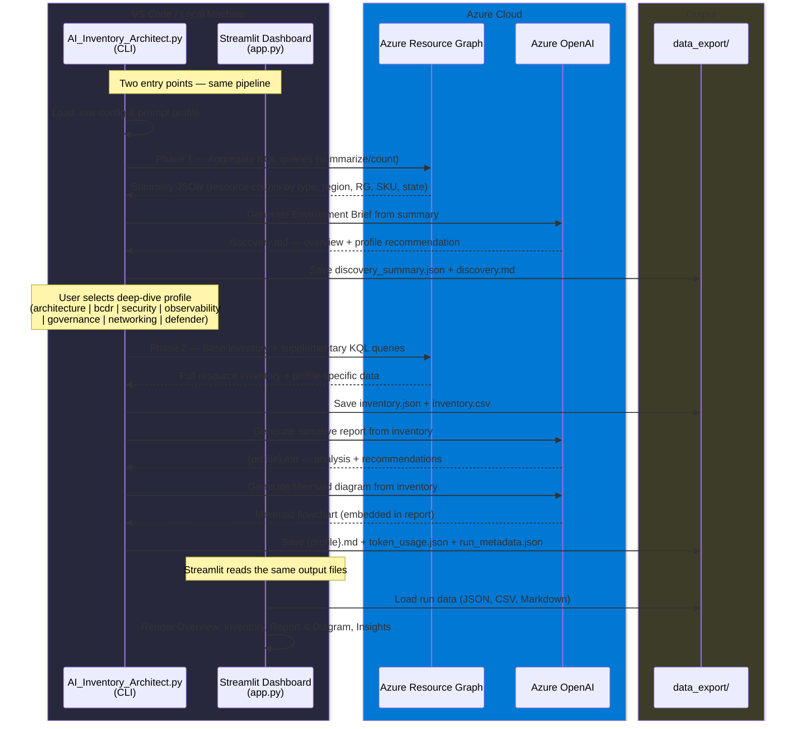

# AI Inventory Architect

Azure infrastructure inventory and AI-powered documentation tool. Queries Azure Resource Graph, exports structured JSON and CSV reports, and optionally generates architecture documentation and Mermaid diagrams using Azure OpenAI — all driven by configurable prompt profiles.


> **Disclaimer — Proof of Concept · Not for Production Decisions**
>
> AI Inventory Architect is an open-source scaffold project in **proof-of-concept (POC) stage**. All AI-generated reports rely on automated interpretations of Azure Resource Graph data and are subject to inherent limitations including hard-coded defaults, token limits, model reasoning constraints, and incomplete resource visibility.
>
> **This tool and its outputs do not constitute professional advice and must not be used as the sole basis for architectural, security, compliance, or financial decisions.** No commercial warranty, liability, or accountability is implied by the authors or contributors.
>
> The value of this project lies in demonstrating how automated inventory collection, structured normalization, and AI-powered analysis can accelerate cloud governance workflows. Organizations are encouraged to evaluate this scaffold with their internal engineering teams or with a trusted Microsoft partner to build a responsible, production-grade solution tailored to their Azure environment and its specific requirements.


---

## Why This Project Matters

### The Governance Gap

Most organizations treat Azure IT Governance as a cost center — a compliance checkbox that generates spreadsheets nobody reads, passed between teams who dread the exercise. The result is predictable: outdated inventories, blind spots in security posture, architecture drift that compounds silently until an incident forces a fire drill.

**This project exists to close that gap.**

AI Inventory Architect is not just a script. It is a working scaffold that demonstrates how infrastructure governance can shift from **reactive burden** to **proactive capability** — where every execution produces a living, queryable, AI-enriched picture of what you actually have running in Azure.

### What Industry Leaders Are Saying

> *"By 2026, organizations that implement continuous cloud governance automation will reduce cloud-related security incidents by 45% and unplanned spend overruns by 30%."*
> — Gartner, Predicts 2025: Cloud Infrastructure and Platform Services

> *"The biggest risk in cloud governance isn't non-compliance — it's the six-month-old spreadsheet everyone trusts but nobody maintains."*
> — Microsoft Well-Architected Framework, Operational Excellence pillar

> *"Cloud governance must evolve from periodic audits to continuous, automated visibility. Organizations that fail to do so will face compounding technical debt and rising security exposure."*
> — Forrester Research, The State of Cloud Governance, 2025

> *"Companies with mature IT asset management practices achieve 30% lower total cost of ownership and 50% faster incident resolution."*
> — ITIL 4: Create, Deliver and Support (Axelos/PeopleCert)

These are not aspirational quotes. They describe the exact trajectory this project puts your team on.

### Normalization and Standardization: The Compound Effect

When every team, subscription, and environment is inventoried through the same KQL query, exported in the same CSV schema, and documented through the same AI prompt profiles, something powerful happens:

- **Consistent taxonomy** — Service categories, IaC detection, and SKU naming follow a single convention. No more "is it `Standard_D2s_v3` or `D2s v3`?" debates across teams.
- **Comparable baselines** — Tuesday's architecture review and Friday's security assessment share the same resource snapshot. Decisions are grounded in the same truth.
- **Repeatable audits** — Auditors, architects, and finance leads receive reports generated from the same pipeline. The format is known, the columns are documented, the method is transparent.
- **Institutional memory** — Every execution is timestamped and versioned in `data_export/`. The organization builds a chronological record of its Azure footprint without anyone manually maintaining it.

Standardization is not bureaucracy. It is the foundation that makes velocity possible. You cannot move fast on a surface you cannot see.

### Building a Stronger Foundation on Current Architecture

This project does not replace your existing Azure governance tools — it **amplifies** them. It sits on top of what you already have:

| You already have | This project adds |
|---|---|
| Azure Resource Graph | Automated extraction, flattened CSV, derived columns for analytics |
| Azure Policy and tags | IaC detection parsed from tags, service categorization, child-resource flagging |
| Azure OpenAI deployment | Targeted prompts that turn raw inventory into architecture narratives, BCDR assessments, security reviews |
| VS Code and CLI skills | A modular Python codebase your team can read, extend, and own |

The six built-in prompt profiles (architecture, BCDR, security, observability, governance, networking) are **starting positions, not finish lines**. They demonstrate a pattern: take a structured dataset, apply a domain-specific prompt, produce a deliverable that used to take days of manual effort. Your team should build on this scaffold — add profiles for Application Insights telemetry, Defender for Cloud findings, or FinOps chargebacks. The pattern is the product.

### From Cost Center to Catalyst

Here is the transformation this project enables:

**Before** — Governance is synonymous with restriction. The governance team is the group that says "no," produces 80-page compliance decks, and is invited to meetings only when something goes wrong. Engineers avoid them. Leadership tolerates them. Nobody is excited.

**After** — The same team runs `python AI_Inventory_Architect.py`, selects the `security` profile, and in under 60 seconds  (for my small scale environment as a benchmark) delivers an AI-generated security posture assessment with a Mermaid diagram that a CISO can present in a board meeting. They switch to `observability`, and within a minute they have a monitoring coverage assessment with actionable recommendations derived from real diagnostic data. They switch to `architecture`, and an architecture review document materializes — complete with resource relationships and provisioning state analysis.

The deliverable is no longer the pain. **The insight is the product.**

When governance teams can produce high-quality, visually compelling, data-driven deliverables in minutes instead of weeks, something shifts:

- **Engineers want to collaborate** because the output is useful, not punitive.
- **Leadership funds the initiative** because the ROI is visible and immediate.
- **The team itself is energized** because they are building, creating, and shipping — not copy-pasting between portals and spreadsheets.

This is the inflection point where governance stops being a cost line and starts being a competitive advantage. The organization that masters its cloud inventory — and can articulate what it has, why it has it, and what to do about it — moves faster, spends smarter, and sleeps better.

### Master the Concepts, Then Build

This project is deliberately designed as a **learning scaffold**. Every module is small enough to read in five minutes. Every pattern (KQL extraction → structured export → AI enrichment → deliverable) is explicit and traceable. The team should:

1. **Understand the pipeline** — Follow a single execution from `config.load()` to the final `.md` file. Know what each module does and why.
2. **Customize the prompts** — Modify `agent_use_cases.txt` to match your organization's language, compliance frameworks, and reporting standards.
3. **Extend the modules** — Add pagination, subscription filtering, retry logic, structured logging. The "Known Limitations" section below is your roadmap.
4. **Integrate into workflows** — Schedule executions, pipe CSV into Power BI, feed `.md` files into SharePoint or Confluence, trigger alerts on inventory drift.
5. **Own the tool** — This is not a vendor product. It is your code, your prompts, your pipeline. The team that owns its governance tooling owns its governance posture.

The goal is not to run this script forever. The goal is to internalize the pattern — **automated collection, structured normalization, AI-powered analysis, actionable deliverable** — and apply it to every governance challenge that crosses your desk.

---

## Project Scope

| Capability | Description |
|---|---|
| **Environment Discovery (Phase 1)** | Lightweight aggregate KQL queries produce a fixed-size summary regardless of tenant scale. An AI-generated **Environment Brief** provides an instant overview of an unknown Azure estate and recommends which deep-dive profile to run next. |
| **Inventory collection (Phase 2)** | Query Azure Resource Graph for all resources across subscriptions with enriched metadata (tags, SKU, kind, provisioning state). |
| **CSV export** | Flat CSV with derived columns: service category, child resource detection, IaC hints from tags. |
| **AI documentation** | Send inventory to Azure OpenAI to generate a Markdown narrative (architecture review, security assessment, BCDR, observability, governance, or networking). |
| **Mermaid diagrams** | AI-generated flowchart diagrams normalized for VS Code Preview. |
| **Token tracking** | Per-call token usage reporting and JSON audit file. |
| **Prompt profiles** | Seven built-in deep-dive use cases selectable via `.env`, plus a template for custom profiles. |

## How It Works — End-to-End Flow



## Project Structure

```
AI_Inventory_Architect.py           # Main entry point — two-phase orchestration
agent_use_cases.txt                 # Prompt definitions (discovery + 7 deep-dive profiles + template)
modules/
  __init__.py
  az_cli.py                         # Azure CLI wrapper: run, login, extract JSON
  config.py                         # Load and validate .env configuration
  inventory.py                      # Resource Graph queries: fetch_summary() + fetch()
  export_csv.py                     # CSV export with derived columns
  prompt_loader.py                  # Parse agent_use_cases.txt for selected profile
  ai_client.py                      # Azure OpenAI calls via the openai SDK
  export_markdown.py                # Assemble .md with normalized Mermaid diagram + disclaimer
  token_tracker.py                  # Token usage reporting and JSON audit
  kql/                              # Modular KQL query library
    __init__.py                     # Registry — resolves profile to query set
    base.py                         # Base inventory query shared by all profiles
    discovery.py                    # Lightweight aggregate queries for Phase 1 Environment Brief
    architecture.py                 # Supplementary queries for architecture review
    bcdr.py                         # Supplementary queries for BCDR analysis
    security.py                     # Supplementary queries for security assessment
    observability.py                 # Supplementary queries for observability & monitoring assessment
    governance.py                   # Supplementary queries for governance audit
    networking.py                   # Supplementary queries for network topology
    defender.py                     # Supplementary queries for Defender for Cloud misconfigurations
data_export/
  <YYYY-MM-DD_HHMMSS>/             # One folder per execution
    discovery_summary.json          # Phase 1 aggregate summary (when AI enabled)
    discovery.md                    # AI-generated Environment Brief (when AI enabled)
    inventory.json                  # Combined inventory (base + supplementary data)
    inventory.csv                   # Flat CSV with derived columns
    {profile}.md                    # AI-generated report + Mermaid (named after selected profile)
    token_usage.json                # Token consumption audit (when AI enabled)
requirements.txt                    # Python dependencies
.env                                # Environment variables (not committed)
prompt-requirements.txt             # Legacy prompt file (PS1 script only)
app.py                              # Streamlit dashboard — Overview (home page)
pages/                              # Streamlit multi-page UI
  1_Inventory.py                    # Interactive inventory table with sidebar filters
  2_Report.py                       # Auto-detected profile report + Mermaid diagram
  3_Insights.py                     # Token usage gauges + run history comparison
streamlit_app/                      # Shared helpers for Streamlit pages
  __init__.py
  helpers.py                        # Run listing, data loading, shared sidebar
```

## Baseline Environment Versions

| Component | Version |
|---|---|
| Python | 3.11.0 |
| Azure CLI (`azure-cli`) | 2.81.0 |
| Resource Graph extension (`resource-graph`) | 2.1.0 |
| python-dotenv | 1.2.2 |
| openai | 2.32.0 |
| azure-identity | 1.25.3 |
| streamlit | 1.56.0 |
| pandas | 3.0.2 |

> Newer versions should be compatible. If you encounter issues, align with the versions above.

## Prerequisites

### Azure Permissions

The script runs under the identity signed in via `az login`. The following permissions are required:

| Scope | Minimum role | Used for |
|---|---|---|
| Subscriptions you want inventoried | **Reader** | Base inventory and supplementary Resource Graph queries |
| Azure OpenAI resource | **Cognitive Services User** (or an API key) | AI documentation generation |

If your identity does not have Reader on a subscription, those resources are silently excluded from the inventory. Supplementary queries against tables like `SecurityResources` or `PolicyResources` may require additional roles (e.g. Security Reader); failed queries are skipped with a warning.

### Azure OpenAI Authentication

The project supports two authentication methods for Azure OpenAI. Azure Resource Graph access always uses the `az login` session.

#### Option 1 — API Key Authentication

| | |
|---|---|
| **How it works** | A static key is sent with every request via the `api-key` header. No extra Azure RBAC role required on the OpenAI resource. |
| **Endpoint format** | Regional **or** custom-subdomain — both work. |
| **Python packages** | `openai` |

**Endpoint examples:**

```
# Regional endpoint (Azure Foundry default)
https://swedencentral.api.cognitive.microsoft.com/

# Custom subdomain endpoint
https://my-openai-resource.openai.azure.com/
```

**`.env` values:**

```ini
AZURE_OPENAI_ENDPOINT=https://swedencentral.api.cognitive.microsoft.com/
AZURE_OPENAI_API_KEY=your-api-key-here
```

> **Where to find the key:** Azure Portal → your OpenAI resource → **Keys and Endpoint** → Key 1.

#### Option 2 — Keyless / Entra ID Authentication *(recommended)*

| | |
|---|---|
| **How it works** | Uses `DefaultAzureCredential` (e.g. your `az login` session) with `get_bearer_token_provider` to obtain a short-lived token. No API key stored on disk. |
| **Endpoint format** | **Must** be a custom-subdomain endpoint. Regional endpoints are **not** supported for token-based auth. |
| **Python packages** | `openai`, `azure-identity` |

**Endpoint example:**

```
https://my-openai-resource.openai.azure.com/
```

**`.env` values:**

```ini
AZURE_OPENAI_ENDPOINT=https://my-openai-resource.openai.azure.com/
AZURE_OPENAI_API_KEY=
```

> Leave `AZURE_OPENAI_API_KEY` empty (or remove the line entirely) to activate keyless mode.

**Prerequisites:**

1. `pip install azure-identity openai`
2. `az login` (or any credential chain that `DefaultAzureCredential` supports — managed identity, environment variables, etc.)
3. Your identity must have the **Cognitive Services OpenAI User** role on the Azure OpenAI resource.
   - Portal → resource → **Access control (IAM)** → Add role assignment.

#### How the code determines auth mode

```
AZURE_OPENAI_API_KEY is non-empty  →  Option 1 (API key)
AZURE_OPENAI_API_KEY is empty/missing  →  Option 2 (Keyless / Entra ID)
```

The auth mode is displayed in the console at startup under `AZURE_OPENAI_AUTH_MODE`.

#### Azure CLI authentication (Resource Graph)

The script authenticates to Azure Resource Graph via `az login --tenant <tenant-id>`. This opens an interactive browser-based login flow (or reuses cached credentials if already signed in). Service principal and managed identity authentication can be configured via standard Azure CLI methods (`az login --service-principal`).

### Azure CLI

Install the Azure CLI for your OS:

- **Windows (winget)**: `winget install -e --id Microsoft.AzureCLI`
- **Windows (MSI)**: <https://learn.microsoft.com/cli/azure/install-azure-cli-windows>
- **macOS**: `brew install azure-cli`
- **Linux (Ubuntu/Debian)**: `curl -sL https://aka.ms/InstallAzureCLIDeb | sudo bash`

Verify: `az --version`

### Azure Resource Graph extension

```bash
# Check if installed
az extension list --query "[?name=='resource-graph']" --output table

# Install if missing
az extension add --name resource-graph
```

## Python Environment Setup

```bash
# 1. Create virtual environment
python -m venv .venv

# 2. Activate it
#    Windows PowerShell:  .venv\Scripts\Activate.ps1
#    Windows cmd:         .venv\Scripts\activate.bat
#    Linux / macOS:       source .venv/bin/activate

# 3. Install dependencies
pip install -r requirements.txt
```

## Recommended IDE

This project is developed and tested with **[Visual Studio Code](https://code.visualstudio.com/)**. The extensions below ensure a smooth experience across Python, Markdown/Mermaid previews, Azure connectivity, and version control.

### Required extensions

| Extension | ID | Purpose |
|---|---|---|
| Python | `ms-python.python` | Python language support, IntelliSense, virtual environment detection |
| Pylance | `ms-python.vscode-pylance` | Type checking and fast autocompletion for Python |
| Python Debugger | `ms-python.debugpy` | Breakpoint debugging for Python scripts |
| PowerShell | `ms-vscode.powershell` | Terminal and language support for `.ps1` files |

### Recommended extensions

| Extension | ID | Purpose |
|---|---|---|
| Markdown All in One | `yzhang.markdown-all-in-one` | Markdown editing, TOC, preview shortcuts |
| Markdown Preview Mermaid | `bierner.markdown-mermaid` | Render Mermaid diagrams in Markdown preview |
| markdownlint | `davidanson.vscode-markdownlint` | Lint Markdown files for consistency |
| Rainbow CSV | `mechatroner.rainbow-csv` | Column-highlighted CSV viewing for `inventory.csv` |
| YAML | `redhat.vscode-yaml` | Schema validation for YAML/config files |
| Prettier | `esbenp.prettier-vscode` | Auto-format JSON, Markdown, YAML |
| GitLens | `eamodio.gitlens` | Git blame, history, and diff annotations |
| GitHub Copilot Chat | `github.copilot-chat` | AI coding assistant |

### Azure extensions

| Extension | ID | Purpose |
|---|---|---|
| Azure Resources | `ms-azuretools.vscode-azureresourcegroups` | Browse Azure resources from VS Code |
| Azure CLI Tools | `ms-vscode.azurecli` | Syntax highlighting and IntelliSense for `az` commands |
| Bicep | `ms-azuretools.vscode-bicep` | Useful if reviewing IaC templates referenced in reports |

### Quick install (all at once)

```bash
code --install-extension ms-python.python \
     --install-extension ms-python.vscode-pylance \
     --install-extension ms-python.debugpy \
     --install-extension ms-vscode.powershell \
     --install-extension yzhang.markdown-all-in-one \
     --install-extension bierner.markdown-mermaid \
     --install-extension davidanson.vscode-markdownlint \
     --install-extension mechatroner.rainbow-csv \
     --install-extension redhat.vscode-yaml \
     --install-extension esbenp.prettier-vscode \
     --install-extension eamodio.gitlens \
     --install-extension ms-azuretools.vscode-azureresourcegroups \
     --install-extension ms-vscode.azurecli \
     --install-extension ms-azuretools.vscode-bicep
```

## Configuration

> **Security** — The `.env` file contains your Azure OpenAI API key and tenant ID. Do not commit it to version control. If the key is accidentally exposed, rotate it immediately in the Azure portal under your Cognitive Services / Azure OpenAI resource → Keys and Endpoint.

Create a `.env` file in the project root. See the **Azure OpenAI Authentication** section above for endpoint and key guidance.

### Inventory only (minimum)

```ini
AZURE_TENANT_ID=<your-azure-tenant-id>
```

### Full mode — API Key authentication

```ini
AZURE_TENANT_ID=<your-azure-tenant-id>

# --- Azure OpenAI (Option 1 — API Key) ---
AZURE_OPENAI_ENDPOINT=https://swedencentral.api.cognitive.microsoft.com/
AZURE_OPENAI_API_KEY=<your-api-key>
AZURE_OPENAI_API_VERSION=2024-12-01-preview
AZURE_OPENAI_DEPLOYMENT=gpt-5.4-mini
```

### Full mode — Keyless / Entra ID authentication *(recommended)*

```ini
AZURE_TENANT_ID=<your-azure-tenant-id>

# --- Azure OpenAI (Option 2 — Keyless) ---
# Custom-subdomain endpoint required for token auth
AZURE_OPENAI_ENDPOINT=https://<your-resource-name>.openai.azure.com/
AZURE_OPENAI_API_KEY=
AZURE_OPENAI_API_VERSION=2024-12-01-preview
AZURE_OPENAI_DEPLOYMENT=gpt-5.4-mini
```

### Optional settings (defaults shown)

```ini
# Token limits per AI generation stage
AZURE_OPENAI_BRIEF_MAX_COMPLETION_TOKENS=2000
AZURE_OPENAI_DOC_MAX_COMPLETION_TOKENS=25000
AZURE_OPENAI_MERMAID_MAX_COMPLETION_TOKENS=8000

# Resource Graph pagination. Default 500, Azure max 1000.
RESOURCE_GRAPH_PAGE_SIZE=500

# Default prompt profile (selected at the interactive menu).
# Valid: architecture, bcdr, security, observability, governance, networking, defender
PROMPT_PROFILE=architecture
```

## Execution Modes

| `.env` configuration | Behavior | Output files |
|---|---|---|
| Only `AZURE_TENANT_ID` | Inventory collection and CSV export | `inventory.json`, `inventory.csv` |
| All OpenAI vars set | **Phase 1** Environment Brief + **Phase 2** deep-dive report with diagrams | `discovery_summary.json`, `discovery.md`, `inventory.json`, `inventory.csv`, `{profile}.md`, `token_usage.json` |

## Two-Phase Execution Architecture

The script now uses a **two-phase approach** designed to scale from small lab environments to large enterprise tenants with thousands of resources.

### Phase 1 — Environment Discovery

Before collecting the full inventory, the script runs **lightweight aggregate KQL queries** that use `summarize` and `count()` operators. These return a fixed-size payload (typically a few hundred rows) regardless of whether the tenant has 50 or 50,000 resources.

The summary data is sent to the LLM to produce an **Environment Brief** — a concise, high-level overview of the Azure estate that:

- Identifies overall scale and complexity (multi-subscription, multi-region posture)
- Highlights dominant resource types and service categories
- Flags concentration risks or anomalies visible from aggregate data alone
- Recommends which deep-dive profile would deliver the most value

The brief is displayed in the console and saved to `discovery.md` before the user chooses a profile.

### Phase 2 — Detailed Analysis

After reviewing the brief, the user selects a deep-dive profile. The script then runs the full base inventory query plus profile-specific supplementary queries, generates the detailed report, and produces the Mermaid diagram.

### Why Two Phases?

| Concern | Single-pass (old) | Two-phase (new) |
|---|---|---|
| Unknown tenant | Blind commit to a profile | Brief reveals what you have first |
| Token budget | Full JSON may exceed context window | Summary fits in ~1,500–3,000 tokens |
| Resource Graph load | All pages fetched before any insight | Summary queries return in a single page |
| User experience | Choose profile with no context | Informed choice after seeing composition |

## Prompt Profiles

The `PROMPT_PROFILE` value in `.env` sets the **default** profile. When AI documentation is enabled, the script shows an interactive menu at runtime where you can pick any available profile or press Enter to accept the default.

### Built-in profiles

| # | Profile ID | Focus |
|---|---|---|
| — | `discovery` | **Auto — Phase 1** Environment Brief (runs before profile selection) |
| 1 | `architecture` | General architecture review, patterns, risks, best practices |
| 2 | `bcdr` | Business continuity, disaster recovery, HA, RTO/RPO gaps |
| 3 | `security` | Security posture, exposure, identity, network, monitoring |
| 4 | `observability` | Monitoring coverage, diagnostic settings, alerting, Log Analytics |
| 5 | `governance` | Tagging audit, naming conventions, RBAC, compliance maturity |
| 6 | `networking` | VNet topology, segmentation, private endpoints, DNS |
| 7 | `defender` | Defender for Cloud bonus report — foundational misconfigurations, CSPM coverage, attack surface |

All profiles are defined in `agent_use_cases.txt`. A template block at the bottom of that file provides a skeleton for creating custom profiles — just add the four required sections and the menu will pick it up automatically.

### Changing the default profile

Edit `.env`:

```
# Switch default to security assessment
PROMPT_PROFILE=security
```

Or simply select a different number at the interactive menu when the script runs.

### Example: interactive menu

After Phase 1 displays the Environment Brief, the profile selection menu appears:

```
=== Phase 2: Detailed Analysis ===
--- AI Documentation Profile ---
Available profiles:
  1. architecture     General architecture review (default)
  2. bcdr             Business Continuity & Disaster Recovery
  3. security         Security posture assessment
  4. observability    Observability & monitoring assessment
  5. governance       Governance, compliance & tagging audit
  6. networking       Network topology & connectivity review

Select a profile [1-6] or press Enter for 'architecture': 3
Using prompt profile: security
```

## Running the Script

### Option 1 — Streamlit Dashboard *(recommended)*

```bash
streamlit run app.py
```

This launches a multi-page web UI at `http://localhost:8501`. The **sidebar** is the primary control surface — it persists across all pages and contains the run selector, run metadata, and a "New Assessment" launcher.

| Page | What it shows |
|---|---|
| **Overview** (home) | KPI cards, discovery distribution charts (type, region, RG, SKU, state), and the AI-generated environment brief from `discovery.md` |
| **Inventory** | Interactive filterable table from `inventory.csv` with sidebar multi-select filters (category, location, RG, state, IaC), distribution charts, and CSV download |
| **Report & Diagram** | Auto-detected `{profile}.md` report with narrative rendered as Markdown and Mermaid diagrams via the Mermaid.js CDN |
| **Insights** | Two tabs — **Token Usage** (per-stage gauges, summary table, totals) and **Run History** (all-runs table with side-by-side comparison and delta metrics) |

### Option 2 — CLI interactive mode *(alternative)*

```bash
python AI_Inventory_Architect.py
```

Runs the two-phase pipeline in the terminal. After Phase 1 displays the Environment Brief, an interactive menu lets you choose a deep-dive profile.

### Option 3 — CLI non-interactive mode *(alternative)*

```bash
python AI_Inventory_Architect.py --profile security
```

The `--profile` flag accepts any valid profile ID (`architecture`, `bcdr`, `security`, `observability`, `governance`, `networking`, `defender`). Phase 1 discovery still runs but the interactive menu is skipped — useful for automation and CI/CD pipelines.

### Sample output (full mode)

```
Saving output files to: C:\GitHub\Inventory\data_export\2026-04-15_103018
Execution started at: 2026-04-15 10:30:18
Signing in to Azure tenant xxxxxxxx-xxxx-xxxx-xxxx-xxxxxxxxxxxx...

--- Configuration ---
  RESOURCE_GRAPH_PAGE_SIZE = 500
  AZURE_OPENAI_DEPLOYMENT  = gpt-5.4-mini
  AZURE_OPENAI_AUTH_MODE   = key
  BRIEF_MAX_TOKENS         = 2000
  DOC_MAX_TOKENS           = 25000
  MERMAID_MAX_TOKENS       = 8000

=== Phase 1: Environment Discovery ===
  Resource Graph PAGE_SIZE: 500
Collecting environment summary from Resource Graph...
    discovery/totals — page 1: 1 rows (running total: 1)
  [discovery/totals] 1 rows | page_size=500 | pages=1 | last page fill=0.2%
    discovery/by_type — page 1: 12 rows (running total: 12)
  [discovery/by_type] 12 rows | page_size=500 | pages=1 | last page fill=2.4%
    ...
  Total resources: 142 across 1 subscription(s), 8 resource group(s), 3 region(s)
  Discovery summary saved to: ...\discovery_summary.json
Generating Environment Brief with AI...
Environment Brief tokens -> prompt: 820, completion: 650 / limit: 2000 (32.5%), remaining: 1350
  Environment Brief saved to: ...\discovery.md

======================================================================
> **Disclaimer — Proof of Concept · Not for Production Decisions** ...

## Environment Overview
This is a small-scale Azure estate spanning 1 subscription across 3 regions
(primary: eastus). The footprint is AI/ML-centric with Cognitive Services
and Container Registry resources...

## Recommended Deep-Dives
• **architecture** — Recommended first pass for a general overview...
• **security** — Public IP and NSG review warranted...
======================================================================

=== Phase 2: Detailed Analysis ===
--- AI Documentation Profile ---
Available profiles:
  1. architecture     General architecture review (default)
  2. bcdr             Business Continuity & Disaster Recovery
  3. security         Security posture assessment
  4. observability    Observability & monitoring assessment
  5. governance       Governance, compliance & tagging audit
  6. networking       Network topology & connectivity review

Select a profile [1-6] or press Enter for 'architecture':

Collecting Azure inventory through Resource Graph (page_size=500)...
    base inventory — page 1: 142 rows (running total: 142)
  [base inventory] 142 rows | page_size=500 | pages=1 | last page fill=28.4%
Inventory saved to: ...\inventory.json
Using prompt profile: architecture
Generating technical documentation with AI...
Documentation tokens -> prompt: 1850, completion: 3200 / limit: 25000 (12.8%), remaining: 21800
Generating Mermaid diagram...
Mermaid tokens -> prompt: 1850, completion: 1100 / limit: 8000 (13.8%), remaining: 6900
Documentation saved to: ...\architecture.md
Token usage saved to: ...\token_usage.json
Execution ended at: 2026-04-15 10:31:15
Total execution time (seconds): 57.00
```

### Output files

**inventory.json** — Combined inventory (base resources + profile-specific supplementary data):

```json
{
  "inventory": [
    {
      "id": "/subscriptions/.../resourceGroups/rg-prod/providers/Microsoft.Compute/virtualMachines/myVM",
      "name": "myVM",
      "type": "microsoft.compute/virtualmachines",
      "location": "eastus",
      "resourceGroup": "rg-prod",
      "subscriptionId": "xxxxxxxx-xxxx-xxxx-xxxx-xxxxxxxxxxxx",
      "tags": { "env": "prod", "managed-by": "terraform" },
      "sku": { "name": "Standard_D2s_v3" },
      "kind": "",
      "identity": { "type": "SystemAssigned" },
      "provisioningState": "Succeeded",
      "properties": { ... }
    }
  ],
  "recovery_vaults": [ ... ],
  "sql_failover_groups": [ ... ]
}
```

The `inventory` key always contains the base resource list. Additional keys vary by profile (e.g. `recovery_vaults` and `sql_failover_groups` for `bcdr`, `security_assessments` and `nsg_rules` for `security`).
```

**inventory.csv** — Derived columns:

| Column | Source | Description |
|---|---|---|
| `name` | `name` | Resource name |
| `type` | `type` | Full ARM resource type |
| `service_category` | derived from `type` | Provider namespace (e.g. `microsoft.compute`) |
| `service_short_type` | derived from `type` | Leaf type (e.g. `virtualmachines`) |
| `is_child_resource` | derived from `type` | `True` if type has more than two segments |
| `location` | `location` | Azure region |
| `resource_group` | `resourceGroup` | Resource group name |
| `subscription_id` | `subscriptionId` | Subscription GUID |
| `kind` | `kind` | Resource variant (e.g. `StorageV2`, `app,linux`) |
| `sku_name` | `sku.name` | Pricing tier / SKU |
| `provisioning_state` | `properties.provisioningState` | Deployment state |
| `iac_hint` | derived from `tags` | Detected IaC tool (`terraform`, `bicep`, `pulumi`, `arm`) or `unknown` |
| `tags` | `tags` | Flattened key=value pairs separated by `;` |

**{profile}.md** — AI-generated narrative + Mermaid diagram (e.g., `architecture.md`, `security.md`).

**token_usage.json** — Token consumption per AI call for auditing.

## Hard-Coded Parameters

| Parameter | Value | Module | Description |
|---|---|---|---|
| `PAGE_SIZE` | `500` (configurable via `RESOURCE_GRAPH_PAGE_SIZE` in `.env`) | `config.py` | Max resources per Resource Graph page (pagination fetches all pages automatically). Default lowered from 1000 to 500 for broader Azure tenant compatibility. |
| `SUMMARY_QUERIES` | 7 aggregate queries | `kql/discovery.py` | Lightweight `summarize`-based queries for Phase 1 Environment Brief |
| `QUERY` (columns) | `id, name, type, location, resourceGroup, subscriptionId, tags, sku, kind, identity, provisioningState, properties` | `kql/base.py` | Columns projected from the Resources table |
| `QUERY` (sort) | `order by type asc` | `kql/base.py` | Result set sort order |
| `SUPPLEMENTARY_QUERIES` | varies per profile | `kql/{profile}.py` | Profile-specific queries against Resources, SecurityResources, AdvisorResources, PolicyResources, ResourceContainers, RecoveryServicesResources |
| `CSV_COLUMNS` | 13 columns | `export_csv.py` | Column names and order in CSV |
| `IAC_TAG_KEYWORDS` | `terraform, bicep, pulumi, arm, iac` | `export_csv.py` | Tag keywords for IaC detection |
| `AZURE_OPENAI_API_VERSION` | `2024-12-01-preview` (configurable via `.env`) | `config.py` | Azure OpenAI API version passed to the `openai` SDK |
| `REQUIRED_SECTIONS` | `DOC_SYSTEM, DOC_USER, MERMAID_SYSTEM, MERMAID_USER` | `prompt_loader.py` | Required sections per deep-dive profile |
| `DISCOVERY_SECTIONS` | `BRIEF_SYSTEM, BRIEF_USER` | `prompt_loader.py` | Required sections for the discovery profile |
| `brief_max_tokens` | `2000` (configurable via `AZURE_OPENAI_BRIEF_MAX_COMPLETION_TOKENS` in `.env`) | `config.py` | Max completion tokens for the Phase 1 Environment Brief |
| `doc_max_tokens` | `25000` (configurable via `AZURE_OPENAI_DOC_MAX_COMPLETION_TOKENS` in `.env`) | `config.py` | Max completion tokens for the Phase 2 deep-dive report |
| `mermaid_max_tokens` | `8000` (configurable via `AZURE_OPENAI_MERMAID_MAX_COMPLETION_TOKENS` in `.env`) | `config.py` | Max completion tokens for the Phase 2 Mermaid diagram |
| `.env` file name | `.env` | `config.py` | Environment file location |

## Known Limitations and Improvement Suggestions

### Azure Resource Graph caps

| Limit | Current behaviour | Impact |
|---|---|---|
| **`--first` page size** | Default `500`, configurable via `RESOURCE_GRAPH_PAGE_SIZE` in `.env`. Pagination via `--skip` collects all pages automatically. | All resources are collected. Azure enforces a max of 1,000 per page; some tenants default to 500. |
| **Request throttling** | Resource Graph enforces per-tenant read throttling (15 requests per 5-second window). | Not an issue for a single run, but repeated executions or very large tenants with many pages could be throttled. |
| **Cross-subscription visibility** | Queries all subscriptions the identity can access, but RBAC may hide some. | Inventory may be partial without Reader role on all subscriptions. |
| **Supplementary query permissions** | Some supplementary tables (SecurityResources, AdvisorResources, PolicyResources, RecoveryServicesResources) require specific RBAC roles. | Queries that fail due to permissions are skipped gracefully with a warning. |

### Azure OpenAI caps

| Limit | Current behaviour | Impact |
|---|---|---|
| **Token limits** | Controlled via `DOC_MAX_COMPLETION_TOKENS` and `MERMAID_MAX_COMPLETION_TOKENS`. | Large inventories may produce truncated documentation if limits are too low. |
| **Rate limiting** | No retry logic on `429` responses. | Rapid sequential calls or shared deployments could hit TPM limits. |
| **Model context window** | The full inventory JSON is sent as the user prompt. Phase 1 mitigates this by providing summary data first. | Very large inventories may still exceed the model's context window in Phase 2. Future improvement: send CSV instead of JSON, or chunk the inventory. |

### Code improvements for production readiness

1. ~~**Implement pagination**~~ — ✅ Done. Resource Graph queries now loop with `--skip` to collect all pages.
2. ~~**Make `--first` configurable**~~ — ✅ Done. Set `RESOURCE_GRAPH_PAGE_SIZE` in `.env` (default 500).
3. **Add subscription filtering** — Optional `AZURE_SUBSCRIPTION_IDS` in `.env` for `--subscriptions`.
4. **Add retry logic with back-off** — Handle transient failures and `429` responses from both Resource Graph and Azure OpenAI.
5. **Structured logging** — Replace `print()` with Python `logging` for levels, file output, and monitoring integration.
6. **Validate output files** — Re-read JSON after write to confirm it is well-formed and non-empty.
7. **Inventory chunking for AI** — For very large inventories, split into batches before sending to Azure OpenAI to stay within context window limits.

## Troubleshooting

| Symptom | Cause | Fix |
|---|---|---|
| `az login` opens browser but fails | Cached credentials expired or MFA required | Run `az account clear` then `az login` again |
| `ERROR: The term 'az' is not recognized` | Azure CLI not installed or not in PATH | Install Azure CLI and restart your terminal |
| `resource-graph extension not found` | Extension missing | Run `az extension add --name resource-graph` |
| `BadRequest: Please provide a custom subdomain for token authentication` | Keyless auth used with a regional endpoint | Switch `AZURE_OPENAI_ENDPOINT` to a custom-subdomain URL (`https://<resource>.openai.azure.com/`). Regional endpoints only support API key auth. |
| `openai.APIConnectionError: Connection error` | DNS cannot resolve the endpoint hostname | Verify the endpoint URL is correct in `.env`. Check Portal → resource → Overview for the exact endpoint. |
| `401 Unauthorized` from Azure OpenAI | Invalid API key, mismatched endpoint, or missing RBAC role | **Key auth:** verify `AZURE_OPENAI_API_KEY` is correct. **Keyless auth:** ensure your identity has the *Cognitive Services OpenAI User* role and the endpoint uses a custom subdomain (`https://<resource>.openai.azure.com`). See the **Authentication** section above. |
| `404 Not Found` from Azure OpenAI | Deployment name wrong | Verify `AZURE_OPENAI_DEPLOYMENT` matches the name in Azure AI Studio → Deployments |
| `429 Too Many Requests` | Rate limit exceeded | Wait 1–2 minutes and retry. For persistent issues, increase your TPM quota in Azure AI Studio |
| `No resources found` / empty inventory | Insufficient RBAC or wrong tenant | Confirm `AZURE_TENANT_ID` is correct and your identity has Reader on target subscriptions |
| Report appears truncated | Token limit too low | Increase `AZURE_OPENAI_DOC_MAX_COMPLETION_TOKENS` in `.env` (e.g. 8000–25000 depending on inventory size) |
| Mermaid diagram does not render | Malformed Mermaid output from LLM | Open the `.md` file in VS Code with the Markdown Preview Mermaid extension. If broken, re-run — LLM output is non-deterministic |
| Supplementary query warning during run | Missing RBAC for that table | Grant the required role (e.g. Security Reader for `SecurityResources`) or safely ignore the warning |

## Modular KQL Query Library

The `modules/kql/` package provides a **profile-aware query system** that enriches the inventory data based on the selected use case. Instead of a single generic KQL query for all profiles, each use case runs the shared base query plus targeted supplementary queries.

### Architecture

```
modules/kql/
  __init__.py          # Registry — maps profile names to query modules
  base.py              # Base query: all resources with full properties (shared by every profile)
  discovery.py         # Phase 1 — lightweight aggregate queries (summarize/count)
  architecture.py      # + resource containers
  bcdr.py              # + recovery vaults, backup items, SQL failover groups, storage replication, VM availability
  security.py          # + Defender assessments, NSG rules, public IPs, Key Vault config
  observability.py   # + Diagnostic settings coverage, Log Analytics workspaces, App Insights, alert rules, action groups, Network Watcher, VM monitoring agents
  governance.py        # + policy compliance state, resource group metadata
  networking.py        # + VNets with subnets/peerings, private endpoints, DNS zones, NSGs, route tables
  defender.py          # + Storage exposure, NSG gaps, disk encryption, Key Vault, SQL TDE, CSPM coverage, IAM risks
```

### How it works

1. The **base query** (`kql/base.py`) projects `id`, `name`, `type`, `location`, `resourceGroup`, `subscriptionId`, `tags`, `sku`, `kind`, `identity`, `provisioningState`, and full `properties` from the `Resources` table. This replaces the previous flat query that lacked `id`, `identity`, and `properties`.

2. Each **profile module** (e.g. `kql/bcdr.py`) exports a `SUPPLEMENTARY_QUERIES` list. Each entry targets a specific Resource Graph table (`Resources`, `SecurityResources`, `AdvisorResources`, `PolicyResources`, `ResourceContainers`, `RecoveryServicesResources`) with a narrow `project` clause.

3. The **registry** (`kql/__init__.py`) uses `importlib` to load the correct profile module at runtime based on the selected `PROMPT_PROFILE`.

4. `inventory.fetch()` runs the base query with pagination, then iterates through supplementary queries. Failed queries (e.g. missing RBAC permissions for `SecurityResources`) are logged and skipped — they do not break the run.

5. The combined output (`inventory.json`) contains an `"inventory"` key with base data plus additional keys for each supplementary query result.

### Adding a new KQL profile

1. Create `modules/kql/<profile_id>.py` with a `SUPPLEMENTARY_QUERIES` list.
2. Add the profile to `_PROFILE_MODULES` in `modules/kql/__init__.py`.
3. Add the corresponding prompt sections in `agent_use_cases.txt`.
4. Add a description entry in `prompt_loader.PROFILE_DESCRIPTIONS`.
