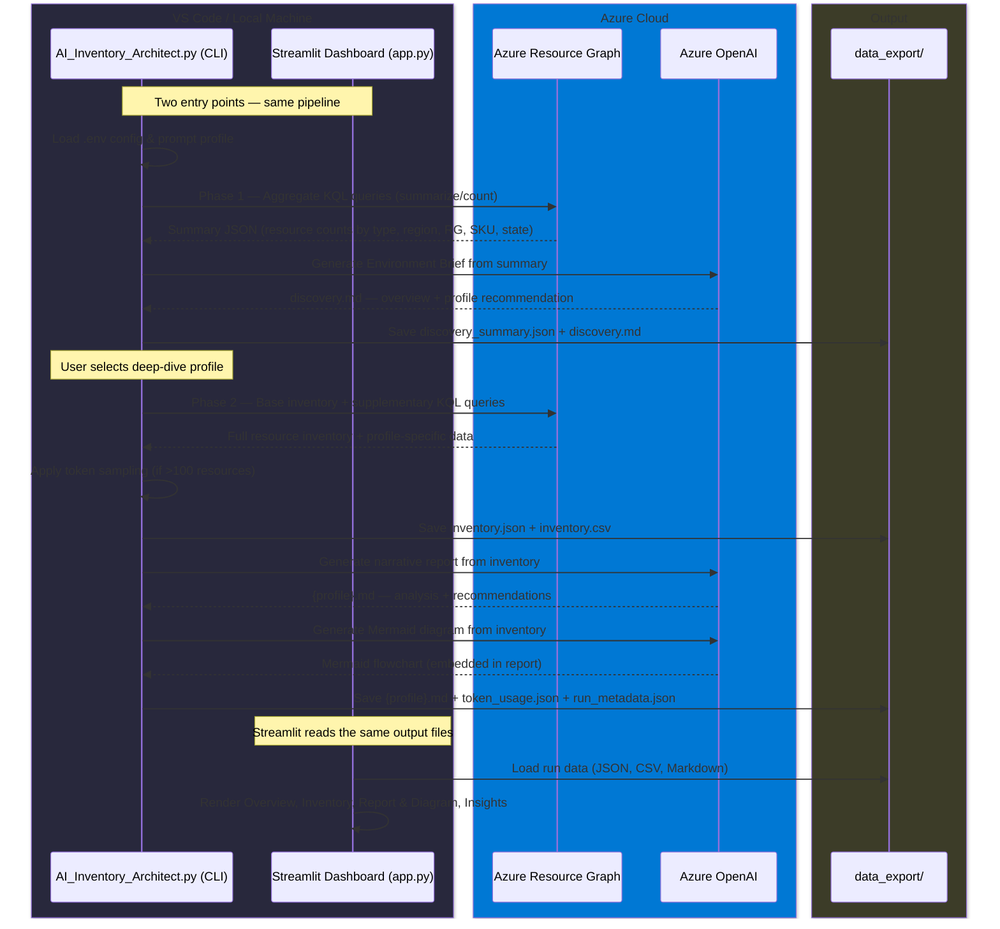

# Architecture & Pipeline — AzurePrism AI Inventory Architect

> **Disclaimer — Proof of Concept · Not for Production Decisions**
>
> AI-generated reports rely on automated interpretations of Azure Resource Graph data. This tool and its outputs do not constitute professional advice and must not be used as the sole basis for architectural, security, compliance, or financial decisions.

← [Back to README](../README.md)

---

## Contents

1. [End-to-End Pipeline](#end-to-end-pipeline)
2. [Two-Phase Execution Model](#two-phase-execution-model)
3. [Project Structure](#project-structure)
4. [Data Schemas](#data-schemas)
5. [Prompt Profiles](#prompt-profiles)
6. [KQL Query Library](#kql-query-library)
7. [Token Management & Optimization](#token-management--optimization)
8. [Configuration Reference](#configuration-reference)

---

## End-to-End Pipeline



---

## Two-Phase Execution Model

### Phase 1 — Environment Discovery

Before collecting the full inventory, the script runs **lightweight aggregate KQL queries** using `summarize` and `count()`. These return a fixed-size payload (typically a few hundred rows) regardless of tenant size — 50 or 50,000 resources.

The summary is sent to Azure OpenAI to produce an **Environment Brief** that:
- Identifies overall scale and complexity (multi-subscription, multi-region posture)
- Highlights dominant resource types and service categories
- Flags concentration risks or anomalies visible from aggregate data alone
- Recommends which deep-dive profile would deliver the most value

Output: `discovery_summary.json` + `discovery.md`

### Phase 2 — Detailed Analysis

After reviewing the brief, the user selects a deep-dive profile. The script runs the full base inventory query plus profile-specific supplementary queries, applies intelligent sampling (for large inventories), generates the detailed report, and produces the Mermaid diagram.

### Why Two Phases?

| Concern | Single-Pass (old) | Two-Phase (current) |
|---|---|---|
| Unknown tenant | Blind commit to a profile | Brief reveals composition first |
| Token budget | Full JSON may exceed context window | Summary fits in ~1,500–3,000 tokens |
| Resource Graph load | All pages fetched before any insight | Summary queries return in a single page |
| User experience | Choose profile with no context | Informed choice after seeing environment |

---

## Project Structure

```
AI_Inventory_Architect.py           # Main entry point — two-phase orchestration
agent_use_cases.txt                 # Prompt definitions (discovery + 7 deep-dive profiles + template)
app.py                              # Streamlit dashboard entry point
requirements.txt                    # Python dependencies
.env                                # Environment variables (not committed)

modules/
  __init__.py
  az_cli.py                         # Azure CLI wrapper: run, login, extract JSON
  config.py                         # Load and validate .env configuration
  constants.py                      # Static configuration, priorities, sampling thresholds
  inventory.py                      # Resource Graph queries: fetch_summary() + fetch()
  inventory_optimizer.py            # Token sampling, critical resource preservation, filtering
  export_csv.py                     # CSV export with derived columns
  prompt_loader.py                  # Parse agent_use_cases.txt for selected profile
  ai_client.py                      # Azure OpenAI calls + token validation safeguards
  export_markdown.py                # Assemble .md with normalized Mermaid diagram + disclaimer
  token_tracker.py                  # Token usage reporting and JSON audit
  kql/                              # Modular KQL query library
    __init__.py                     # Registry — resolves profile to query set
    base.py                         # Base inventory query shared by all profiles
    discovery.py                    # Lightweight aggregate queries for Phase 1
    architecture.py                 # + resource containers
    bcdr.py                         # + recovery vaults, backup items, SQL failover groups
    security.py                     # + Defender assessments, NSG rules, public IPs, Key Vault
    observability.py                # + Diagnostics, Log Analytics, App Insights, alert rules
    governance.py                   # + Policy compliance, resource group metadata
    networking.py                   # + VNets, private endpoints, DNS zones, route tables
    defender.py                     # + Storage exposure, disk encryption, CSPM, IAM risks
    KQL_Tech_Spec.md                # Full technical specification for KQL framework

pages/
  welcome.py                        # Landing page — project intro, architecture overview
  0_Overview.py                     # KPI cards, discovery charts, environment brief
  1_Inventory.py                    # Interactive filterable inventory table
  2_Report.py                       # Profile report + Mermaid diagram rendering
  3_Insights.py                     # Token usage gauges + run history comparison

streamlit_app/
  __init__.py
  helpers.py                        # Run listing, data loading, shared sidebar, UI helpers

tests/
  __init__.py
  test_ai_client.py                 # 9 unit tests: token estimation + API safeguards
  test_inventory_optimizer.py       # 35 unit tests: sampling, filtering, priorities

test_end_to_end.py                  # 8 end-to-end validation categories (synthetic data)

data_export/
  <YYYY-MM-DD_HHMMSS_profile>/      # One folder per execution
    discovery_summary.json          # Phase 1 aggregate summary
    discovery.md                    # AI-generated Environment Brief
    inventory.json                  # Combined inventory (base + supplementary data)
    inventory.csv                   # Flat CSV with derived columns
    {profile}.md                    # AI-generated report + Mermaid diagram
    token_usage.json                # Token consumption audit
    run_metadata.json               # Sampling stats, timing, execution metadata
```

---

## Data Schemas

### inventory.json

```json
{
  "inventory": [
    {
      "id": "/subscriptions/.../resourceGroups/rg-prod/providers/Microsoft.Compute/virtualMachines/myVM",
      "name": "myVM",
      "type": "microsoft.compute/virtualmachines",
      "location": "eastus",
      "resourceGroup": "rg-prod",
      "subscriptionId": "xxxxxxxx-xxxx-xxxx-xxxx-xxxxxxxxxxxx",
      "tags": { "env": "prod", "managed-by": "terraform" },
      "sku": { "name": "Standard_D2s_v3" },
      "kind": "",
      "identity": { "type": "SystemAssigned" },
      "provisioningState": "Succeeded",
      "properties": { "..." : "..." }
    }
  ],
  "recovery_vaults": [],
  "sql_failover_groups": []
}
```

The `inventory` key always contains the base resource list. Additional keys vary by profile (e.g. `recovery_vaults` and `sql_failover_groups` for `bcdr`, `security_assessments` and `nsg_rules` for `security`).

### inventory.csv Columns

| Column | Source | Description |
|---|---|---|
| `name` | `name` | Resource name |
| `type` | `type` | Full ARM resource type |
| `service_category` | derived | Provider namespace (e.g. `microsoft.compute`) |
| `service_short_type` | derived | Leaf type (e.g. `virtualmachines`) |
| `is_child_resource` | derived | `True` if type has more than two segments |
| `location` | `location` | Azure region |
| `resource_group` | `resourceGroup` | Resource group name |
| `subscription_id` | `subscriptionId` | Subscription GUID |
| `kind` | `kind` | Resource variant (e.g. `StorageV2`, `app,linux`) |
| `sku_name` | `sku.name` | Pricing tier / SKU |
| `provisioning_state` | `properties.provisioningState` | Deployment state |
| `iac_hint` | derived from `tags` | Detected IaC tool (`terraform`, `bicep`, `pulumi`, `arm`) or `unknown` |
| `tags` | `tags` | Flattened key=value pairs separated by `;` |

---

## Prompt Profiles

The `PROMPT_PROFILE` value in `.env` sets the default. At runtime an interactive menu lets you pick any profile or press Enter for the default.

| # | Profile ID | Focus Area |
|---|---|---|
| — | `discovery` | Auto — Phase 1 Environment Brief |
| 1 | `architecture` | Architecture review, patterns, risks, best practices |
| 2 | `bcdr` | Business continuity, disaster recovery, HA, RTO/RPO gaps |
| 3 | `security` | Security posture, exposure, identity, network, monitoring |
| 4 | `observability` | Monitoring coverage, diagnostic settings, alerting |
| 5 | `governance` | Tagging audit, naming conventions, RBAC, compliance maturity |
| 6 | `networking` | VNet topology, segmentation, private endpoints, DNS |
| 7 | `defender` | Defender for Cloud misconfigurations, CSPM coverage |

All profiles are defined in `agent_use_cases.txt`. A template block at the bottom provides a skeleton for custom profiles — add the four required sections (`DOC_SYSTEM`, `DOC_USER`, `MERMAID_SYSTEM`, `MERMAID_USER`) and the menu picks it up automatically.

### Adding a Custom Profile

1. Add a new block in `agent_use_cases.txt` with the four required sections
2. Create `modules/kql/<profile_id>.py` with a `SUPPLEMENTARY_QUERIES` list
3. Register the profile in `modules/kql/__init__.py` → `_PROFILE_MODULES`
4. Add a description entry in `prompt_loader.PROFILE_DESCRIPTIONS`

---

## KQL Query Library

### Architecture

```
modules/kql/
  __init__.py          # Registry — maps profile names to query modules
  base.py              # All resources with full properties (shared by every profile)
  discovery.py         # Phase 1 — lightweight aggregate queries (summarize/count)
  architecture.py      # + resource containers
  bcdr.py              # + recovery vaults, backup items, SQL failover, VM availability
  security.py          # + Defender assessments, NSG rules, public IPs, Key Vault config
  observability.py     # + Diagnostic coverage, Log Analytics, App Insights, alert rules
  governance.py        # + Policy compliance, resource group metadata
  networking.py        # + VNets with subnets/peerings, private endpoints, DNS, route tables
  defender.py          # + Storage exposure, disk encryption, SQL TDE, CSPM, IAM risks
```

### How It Works

1. **Base query** (`kql/base.py`) projects `id`, `name`, `type`, `location`, `resourceGroup`, `subscriptionId`, `tags`, `sku`, `kind`, `identity`, `provisioningState`, and full `properties` from the `Resources` table.
2. **Profile modules** (e.g. `kql/bcdr.py`) export a `SUPPLEMENTARY_QUERIES` list targeting specific Resource Graph tables with narrow `project` clauses.
3. **Registry** (`kql/__init__.py`) uses `importlib` to load the correct profile module at runtime.
4. `inventory.fetch()` runs the base query with pagination, then iterates supplementary queries. Failed queries (e.g. missing RBAC) are skipped with a warning — they do not break the run.
5. Combined output (`inventory.json`) contains `"inventory"` key with base data plus additional keys per supplementary query.

Full KQL technical specification: [modules/kql/KQL_Tech_Spec.md](../modules/kql/KQL_Tech_Spec.md)

---

## Token Management & Optimization

### The Problem

At scale, a 500-resource inventory produces ~110,000+ tokens in JSON format. Azure OpenAI's hard ceiling is 272,000 tokens per call — leaving no headroom at enterprise scale.

### Solution: Intelligent Sampling

The `modules/inventory_optimizer.py` module implements a **three-tier sampling strategy** with critical resource preservation:

#### Sampling Tiers

| Inventory Size | Target Sample | Token Reduction | Resources Kept |
|---|---|---|---|
| 0–100 resources | 100% | 0% (no sampling) | All |
| 101–300 resources | 80% | ~20% | All critical + top 80% by priority |
| 301–500 resources | 60% | ~40% | All critical + top 60% by priority |
| 500+ resources | 40% | ~40–60% | All critical + top 40% by priority |

#### Critical Resources (always preserved)

The following 11 resource types are **never dropped** during sampling:
- Virtual Machines, SQL Databases, PostgreSQL/MySQL Servers
- App Services, Key Vaults, Virtual Networks, NSGs
- Load Balancers, Traffic Managers, Public IPs, App Insights

#### Profile-Specific Filtering

Each of the 7 profiles has a custom resource type priority mapping. Security profiles prioritize NSGs, Public IPs, and Defender findings. Networking profiles prioritize VNets and private endpoints. Resources are reordered by relevance before sampling — ensuring the most relevant resources for the chosen profile are most likely to be retained.

#### Validated Outcomes (from end-to-end test suite)

| Scale | Resources | Token Reduction | Critical Preserved |
|---|---|---|---|
| Small | 50 | 0% (no sampling needed) | 100% |
| Medium | 200 | 20.4% | 100% |
| Large | 500 | 40.6% | 100% |

### Token Estimation

Pre-call token estimation uses a conservative **224 tokens/KB** ratio (validated to ±0% accuracy). Before each API call, the system estimates total prompt tokens. If the estimate exceeds `AZURE_OPENAI_MAX_INPUT_TOKENS` (default: 272,000), the call is rejected with a descriptive error rather than failing at the API boundary.

### Disclaimer Handling

The report disclaimer (~250 tokens) is stored once in `modules/constants.REPORT_DISCLAIMER`. It is:
- **Added** to exported Markdown files (`{profile}.md`) automatically
- **Displayed** in the Streamlit UI via collapsible expander
- **Never sent** to the LLM — saving ~2,250 tokens per full run (250 × 9 calls)

---

## Configuration Reference

### Hard-Coded Parameters

| Parameter | Value | Module | Description |
|---|---|---|---|
| `PAGE_SIZE` | `500` (configurable) | `config.py` | Max resources per Resource Graph page |
| `SUMMARY_QUERIES` | 7 aggregate queries | `kql/discovery.py` | Phase 1 lightweight queries |
| `QUERY` columns | 12 columns | `kql/base.py` | Columns projected from Resources table |
| `CSV_COLUMNS` | 13 columns | `export_csv.py` | CSV column names and order |
| `IAC_TAG_KEYWORDS` | `terraform, bicep, pulumi, arm, iac` | `export_csv.py` | Tag keywords for IaC detection |
| `AZURE_OPENAI_API_VERSION` | `2024-12-01-preview` | `config.py` | Azure OpenAI API version |
| `brief_max_tokens` | `2000` (configurable) | `config.py` | Max completion tokens for Phase 1 brief |
| `doc_max_tokens` | `25000` (configurable) | `config.py` | Max completion tokens for Phase 2 report |
| `mermaid_max_tokens` | `8000` (configurable) | `config.py` | Max completion tokens for Mermaid diagram |
| `SAMPLING_THRESHOLD_MIN` | `100` | `constants.py` | Resources below this: no sampling |
| `MAX_INPUT_TOKENS` | `272,000` (configurable) | `config.py` | Hard ceiling for pre-call validation |

---

→ [Getting Started](./GETTING_STARTED.md) | [Testing](./TESTING.md) | [Capacity & Scaling](./CAPACITY_AND_SCALING.md) | [Troubleshooting](./TROUBLESHOOTING.md)
