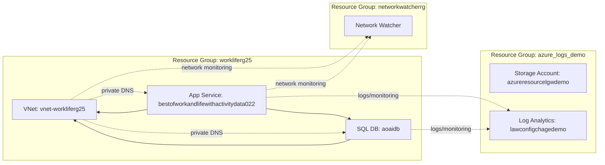

# Documento de Arquitetura – Inventário do Ambiente Azure

## 1. Sumário executivo

O ambiente Azure inventariado indica uma solução orientada a aplicações web com integração de IA/Foundry, banco de dados SQL, observabilidade centralizada, segurança básica habilitada e uso de rede privada via Private DNS e VNet. Há também componentes de suporte para CI/CD e integração com ACR.

Em termos de arquitetura, o cenário sugere:

- **Aplicação Web em App Service**
- **Banco de dados Azure SQL**
- **Azure AI Foundry / Cognitive Services**
- **Azure Container Registry**
- **Rede virtual e DNS privado**
- **Log Analytics / Azure Monitor / Defender for Cloud**
- **Automação de segurança para exportação de eventos**
- **Componentes de suporte para troubleshooting de rede**

Apesar de haver sinais de boas práticas, o inventário também revela **riscos importantes de governança, padronização e segurança**, especialmente:
- recursos em **múltiplas regiões sem justificativa aparente**
- **nomenclatura inconsistente**
- possível **ausência de segregação por ambiente**
- indícios de **configuração incompleta de rede privada**
- presença de recursos de monitoramento e segurança, mas sem evidência de hardening completo
- uso de **soluções clássicas do Defender/OMS**, que podem indicar legado ou configuração não otimizada

---

## 2. Escopo da análise

Este documento foi elaborado com base exclusivamente no inventário fornecido, sem acesso às propriedades detalhadas dos recursos. Portanto, a análise considera:

- tipo de recurso
- nome
- região
- grupo de recursos
- padrões arquiteturais inferidos
- riscos e boas práticas potencialmente não seguidas

Não foi possível validar:
- SKU
- configurações de rede
- identidade gerenciada
- políticas de acesso
- criptografia
- backups
- diagnósticos
- tags
- locks
- dependências entre recursos

---

## 3. Visão geral da arquitetura inferida

### 3.1 Componentes principais

#### Camada de aplicação
- **Azure App Service Plan**
  - `bestofworkandlifewithsportdata`
- **Azure App Service**
  - `bestofworkandlifewithactivitydata022`

#### Camada de dados
- **Azure SQL Server**
  - `workliferg25qcaio77`
- **Azure SQL Database**
  - `aoaidb`
  - `master`

#### Camada de IA / GenAI
- **Azure AI Foundry / Cognitive Services Account**
  - `myAzFoundry-workliferg25`
- **Projeto do Foundry**
  - `myAzFoundry-workliferg25/myAzFoundry-workliferg25-proj`

#### Camada de containerização
- **Azure Container Registry**
  - `workliferg25`
- **Webhook do ACR**
  - `bestofworkandlifewithactivitydata022c08740`

#### Rede e resolução de nomes
- **Virtual Network**
  - `vnet-workliferg25`
- **Private DNS Zones**
  - `privatedns-workliferg25.local`
  - `privatelink.database.windows.net`
  - `privatelink.azurewebsites.net`
- **Virtual Network Links**
  - `34297b6dc3608`
  - `privatedns-workliferg25.local-vnetlink`
  - `tbsum6qz747vc`

#### Observabilidade e segurança
- **Log Analytics Workspace**
  - `lgawkspcdemo2025`
  - `lawconfigchagedemo`
- **Azure Monitor Workbook**
  - `9f53d5ba-04a3-4b3b-812f-81d233f98023`
- **Defender for Cloud / OMS Solutions**
  - `Security(lgawkspcdemo2025)`
  - `SecurityCenterFree(lgawkspcdemo2025)`
- **Microsoft Security Automation**
  - `ExportToWorkspace`

#### Suporte de rede
- **Network Watcher**
  - `NetworkWatcher_centralus`
  - `NetworkWatcher_eastus`
  - `NetworkWatcher_swedencentral`

#### Armazenamento auxiliar
- **Storage Account**
  - `azureresourcelgwdemo`

---

## 4. Inventário organizado por tipo de recurso

## 4.1 Azure AI / Cognitive Services

### Recursos
- `myAzFoundry-workliferg25`
- `myAzFoundry-workliferg25/myAzFoundry-workliferg25-proj`

### Interpretação
O ambiente possui uma instância de **Azure AI Foundry / Cognitive Services** e um projeto associado. Isso indica uso de capacidades de IA generativa, experimentação, orquestração de prompts, modelos e possivelmente integração com aplicações.

### Padrão arquitetural identificado
- **AI as a Service**
- **Separação entre conta base e projeto**
- Possível integração com aplicação web e/ou automações

### Riscos
- Não há evidência de:
  - rede privada para o serviço de IA
  - controle de acesso por identidade gerenciada
  - segregação de dados sensíveis
  - governança de prompts/modelos
- Região **centralus** pode não estar alinhada com requisitos de residência de dados, dependendo do contexto regulatório.

### Boas práticas esperadas
- Private Endpoint quando aplicável
- Managed Identity para consumo
- RBAC mínimo necessário
- Logging de uso e auditoria
- Política de conteúdo e proteção contra vazamento de dados

---

## 4.2 Azure Container Registry

### Recursos
- `workliferg25`
- `bestofworkandlifewithactivitydata022c08740` (webhook)

### Interpretação
Há um ACR central para armazenamento de imagens de container e um webhook associado, provavelmente para disparar automações em eventos de push de imagem.

### Padrão arquitetural identificado
- **Container registry centralizado**
- **Integração por webhook com pipeline ou deploy**
- Possível suporte a CI/CD para App Service ou workloads containerizados

### Riscos
- Não há evidência de:
  - conteúdo assinado
  - escaneamento de vulnerabilidades
  - retenção de imagens
  - políticas de acesso restritivas
  - uso de Private Link
- O webhook pode ser um ponto de acoplamento frágil se não houver autenticação robusta e tratamento de falhas.

### Boas práticas esperadas
- ACR com acesso privado
- Admin user desabilitado
- RBAC via Managed Identity
- Content Trust / assinatura de imagens
- Vulnerability scanning
- Retention policy para imagens antigas

---

## 4.3 Azure App Service

### Recursos
- `bestofworkandlifewithsportdata` – App Service Plan
- `bestofworkandlifewithactivitydata022` – Web App

### Interpretação
A aplicação principal parece estar hospedada em **Azure App Service**, com um plano dedicado.

### Padrão arquitetural identificado
- **PaaS web application**
- Possível arquitetura 3 camadas:
  - front-end web
  - backend com SQL
  - integração com IA e/ou containers

### Riscos
- Não há evidência de:
  - deployment slots
  - autoscale
  - backup do app
  - TLS enforcement
  - autenticação integrada
  - VNet Integration
  - Private Endpoint
- O nome do App Service e do plano sugere possível ambiente de demonstração, mas isso não elimina necessidade de hardening.

### Boas práticas esperadas
- HTTPS only
- TLS 1.2+
- Managed Identity
- App Settings protegidos com Key Vault
- Deployment slots para release
- Diagnósticos habilitados
- VNet Integration se houver dependências privadas

---

## 4.4 Azure SQL Database

### Recursos
- `workliferg25qcaio77` – SQL Server
- `aoaidb` – Database
- `master` – Database do sistema

### Interpretação
Há um banco relacional centralizado em Azure SQL, provavelmente usado pela aplicação web.

### Padrão arquitetural identificado
- **Banco relacional gerenciado**
- Possível persistência transacional da aplicação

### Riscos
- Não há evidência de:
  - firewall restritivo
  - Private Endpoint
  - TDE com CMK
  - auditoria
  - threat detection
  - backup/retention policy
- A presença de `master` é normal, mas o inventário não mostra elastic pools, failover groups ou réplicas.

### Boas práticas esperadas
- Private Endpoint para SQL
- Desabilitar acesso público quando possível
- AAD authentication
- Managed Identity para conexão
- Auditoria e Defender for SQL
- Backup e retenção adequados
- Criptografia com chaves gerenciadas pelo cliente, se exigido

---

## 4.5 Rede virtual e DNS privado

### Recursos
- `vnet-workliferg25`
- `privatedns-workliferg25.local`
- `privatelink.database.windows.net`
- `privatelink.azurewebsites.net`
- Links:
  - `34297b6dc3608`
  - `privatedns-workliferg25.local-vnetlink`
  - `tbsum6qz747vc`

### Interpretação
O ambiente possui uma VNet e zonas DNS privadas para integração com SQL e App Service, o que sugere intenção de uso de conectividade privada.

### Padrão arquitetural identificado
- **Hub-and-spoke simplificado ou rede única**
- **Private DNS para serviços PaaS**
- **Resolução privada para SQL e Web Apps**

### Riscos
- Não há evidência de:
  - subnets dedicadas
  - NSGs
  - route tables
  - Azure Firewall
  - NAT Gateway
  - Private Endpoints explicitamente listados
- A existência das zonas DNS não garante que os serviços estejam realmente privados.
- Os nomes dos links DNS parecem parcialmente não padronizados, o que dificulta governança.

### Boas práticas esperadas
- Private Endpoints para SQL, App Service e outros PaaS
- DNS zone links consistentes
- Separação de subnets por função
- NSGs aplicados
- Estratégia hub-spoke se houver crescimento
- Controle de saída com firewall/NAT

---

## 4.6 Observabilidade

### Recursos
- `lgawkspcdemo2025` – Log Analytics Workspace
- `lawconfigchagedemo` – Log Analytics Workspace
- `9f53d5ba-04a3-4b3b-812f-81d233f98023` – Workbook

### Interpretação
Há pelo menos dois workspaces de Log Analytics e um workbook de monitoramento.

### Padrão arquitetural identificado
- **Centralização de logs**
- **Dashboards operacionais**
- Possível separação entre workspace principal e workspace de demonstração/configuração

### Riscos
- Dois workspaces podem indicar:
  - fragmentação de logs
  - duplicidade de custos
  - dificuldade de correlação
- O workbook com nome GUID sugere criação manual ou exportação sem padronização.

### Boas práticas esperadas
- Consolidar workspaces quando possível
- Definir retenção por criticidade
- Padronizar naming
- Habilitar diagnostic settings em todos os recursos relevantes
- Criar alertas e workbooks com nomenclatura funcional

---

## 4.7 Segurança

### Recursos
- `Security(lgawkspcdemo2025)`
- `SecurityCenterFree(lgawkspcdemo2025)`
- `ExportToWorkspace`

### Interpretação
O ambiente possui soluções do Defender for Cloud/OMS associadas ao workspace, além de automação para exportação de dados de segurança.

### Padrão arquitetural identificado
- **Segurança centralizada em Log Analytics**
- **Automação de exportação de eventos**
- Possível uso de plano gratuito do Defender em parte do ambiente

### Riscos
- `SecurityCenterFree` pode indicar cobertura limitada
- Não há evidência de:
  - políticas de segurança aplicadas
  - JIT VM access
  - recomendações tratadas
  - integração com SIEM/SOAR externo
- Automação de exportação sem governança pode gerar ruído e custo

### Boas práticas esperadas
- Defender for Cloud com plano adequado
- Secure Score acompanhado
- Azure Policy para baseline
- Alertas e automações testadas
- Exportação apenas do necessário

---

## 4.8 Network Watcher

### Recursos
- `NetworkWatcher_centralus`
- `NetworkWatcher_eastus`
- `NetworkWatcher_swedencentral`

### Interpretação
Há Network Watchers em múltiplas regiões, o que é comum quando há recursos distribuídos regionalmente.

### Padrão arquitetural identificado
- **Monitoramento regional de rede**
- Suporte a troubleshooting e flow logs

### Riscos
- Pode haver custo e complexidade desnecessários se regiões não forem realmente usadas
- Não há evidência de NSG Flow Logs ou Connection Monitor

### Boas práticas esperadas
- Manter apenas onde necessário
- Habilitar flow logs em NSGs críticos
- Usar Connection Monitor para dependências

---

## 4.9 Storage Account

### Recursos
- `azureresourcelgwdemo`

### Interpretação
Conta de armazenamento auxiliar, possivelmente para logs, exportações ou artefatos.

### Riscos
- Nome sugere uso de demonstração
- Não há evidência de:
  - private endpoint
  - soft delete
  - versioning
  - lifecycle management
  - encryption scope
  - acesso restrito

### Boas práticas esperadas
- Acesso privado
- SAS mínimo necessário
- Defender for Storage
- Versionamento e soft delete
- Lifecycle policy

---

## 5. Padrões de arquitetura identificados

## 5.1 Arquitetura PaaS orientada a aplicação web
O ambiente é fortemente baseado em serviços gerenciados:
- App Service
- Azure SQL
- ACR
- Cognitive Services / AI Foundry
- Log Analytics

Isso reduz esforço operacional, mas exige boa governança.

## 5.2 Integração de IA com aplicação corporativa
A presença do Foundry sugere que a aplicação pode consumir capacidades de IA, possivelmente para:
- geração de conteúdo
- classificação
- automação de atividades
- assistente inteligente

## 5.3 Estratégia de rede privada em evolução
A existência de Private DNS Zones indica intenção de usar conectividade privada para PaaS, mas o inventário não comprova a implementação completa.

## 5.4 Observabilidade centralizada
Há um esforço claro de monitoramento e segurança via Log Analytics, Defender e Workbook.

## 5.5 Suporte a DevOps/CI-CD
ACR + webhook + App Service sugerem pipeline automatizado de build e deploy.

---

## 6. Riscos e não conformidades observadas

## 6.1 Nomenclatura inconsistente
Exemplos:
- nomes com prefixos mistos: `myAzFoundry`, `workliferg25`, `bestofwork...`
- workbook com GUID
- links DNS com nomes não descritivos

### Impacto
- baixa rastreabilidade
- dificuldade de operação
- maior risco de erro humano

### Recomendação
Adotar padrão formal de naming por:
- ambiente
- workload
- região
- tipo de recurso
- criticidade

---

## 6.2 Mistura de regiões sem justificativa clara
Recursos em:
- centralus
- swedencentral
- eastus
- global

### Impacto
- latência
- custo de egress
- complexidade operacional
- risco de não conformidade regulatória

### Recomendação
Definir região primária por workload e justificar exceções.

---

## 6.3 Possível ausência de segregação por ambiente
Os nomes sugerem ambiente de demo/lab, mas não há separação clara entre:
- dev
- test
- prod

### Impacto
- risco de mudanças indevidas
- exposição de dados
- governança fraca

### Recomendação
Separar por subscription ou ao menos por resource groups e políticas.

---

## 6.4 Segurança de rede não comprovada
Há DNS privado, mas não há evidência de:
- Private Endpoints
- NSGs
- firewall
- controle de saída

### Impacto
- exposição pública de PaaS
- bypass de intenção de rede privada

### Recomendação
Validar e implementar private connectivity ponta a ponta.

---

## 6.5 Governança incompleta
Não há evidência de:
- tags
- locks
- Azure Policy
- RBAC padronizado
- blueprint/landing zone

### Impacto
- baixa rastreabilidade de custos
- risco operacional
- dificuldade de auditoria

### Recomendação
Implementar baseline de governança.

---

## 6.6 Fragmentação de observabilidade
Dois workspaces e workbook com GUID sugerem possível falta de padronização.

### Impacto
- duplicidade
- custo
- dificuldade de análise

### Recomendação
Consolidar e padronizar.

---

## 7. Boas práticas não seguidas ou não evidenciadas

A partir do inventário, as seguintes boas práticas **não foram evidenciadas**:

- padronização de naming
- tagging corporativo
- segregação por ambiente
- uso consistente de regiões
- private endpoints em serviços PaaS
- RBAC mínimo necessário
- managed identities
- Key Vault para segredos
- Azure Policy
- backup e DR formalizados
- monitoramento com alertas e SLOs
- hardening de App Service e SQL
- retenção e lifecycle em Storage/ACR
- escaneamento de imagens de container
- auditoria e threat protection em SQL

---

## 8. Recomendações técnicas

## 8.1 Curto prazo
1. Padronizar nomes de recursos.
2. Inventariar tags e aplicar baseline.
3. Validar se SQL e App Service estão realmente privados.
4. Revisar workspaces e consolidar se possível.
5. Confirmar se o ACR está com acesso restrito.
6. Revisar automação `ExportToWorkspace`.
7. Habilitar/validar diagnostic settings em todos os recursos críticos.

## 8.2 Médio prazo
1. Implementar Azure Policy para:
   - tags obrigatórias
   - regiões permitidas
   - restrição de IP público
   - TLS mínimo
2. Adotar Managed Identity em App Service e automações.
3. Integrar Key Vault para segredos e connection strings.
4. Revisar arquitetura de rede com subnets e NSGs.
5. Habilitar Defender for Cloud com cobertura adequada.
6. Implementar backup, restore e DR testado.

## 8.3 Longo prazo
1. Evoluir para landing zone formal.
2. Separar ambientes por subscription.
3. Adotar hub-spoke se houver expansão.
4. Implementar SIEM/SOAR se houver requisitos de segurança.
5. Formalizar governança de IA:
   - acesso
   - logs
   - proteção de dados
   - revisão de prompts e modelos

---

## 9. Arquitetura alvo recomendada

### 9.1 Camadas
- **Edge/Ingress**
  - Front Door ou Application Gateway, se houver exposição pública controlada
- **Aplicação**
  - App Service com deployment slots
- **Integração**
  - ACR com CI/CD e identidade gerenciada
- **Dados**
  - Azure SQL com Private Endpoint
- **IA**
  - Azure AI Foundry com governança e acesso controlado
- **Rede**
  - VNet com subnets dedicadas, NSGs e DNS privado
- **Observabilidade**
  - Log Analytics central, workbooks padronizados, alertas
- **Segurança**
  - Defender for Cloud, Azure Policy, Key Vault, RBAC

### 9.2 Princípios
- zero trust
- least privilege
- private by default
- policy as code
- observability by design
- naming and tagging standards

---

## 10. Conclusão

O ambiente apresenta uma base tecnológica moderna e coerente com uma solução PaaS integrada a IA, com monitoramento e componentes de rede privada. Entretanto, o inventário também evidencia sinais de maturidade arquitetural parcial, principalmente em governança, padronização e segurança de rede.

Em resumo:
- **Pontos fortes**: uso de serviços gerenciados, presença de observabilidade, intenção de conectividade privada, integração com IA e container registry.
- **Pontos de atenção**: nomenclatura, multi-região sem padrão claro, possível ausência de private endpoints, governança fraca e observabilidade fragmentada.

Se desejar, posso transformar este conteúdo em um dos formatos abaixo:
1. **Documento formal em estilo corporativo**
2. **Arquitetura em formato de matriz por recurso**
3. **Relatório executivo + técnico**
4. **Versão com recomendações priorizadas por criticidade**
5. **Diagrama textual da arquitetura alvo**

---

## Diagrama de Arquitetura

