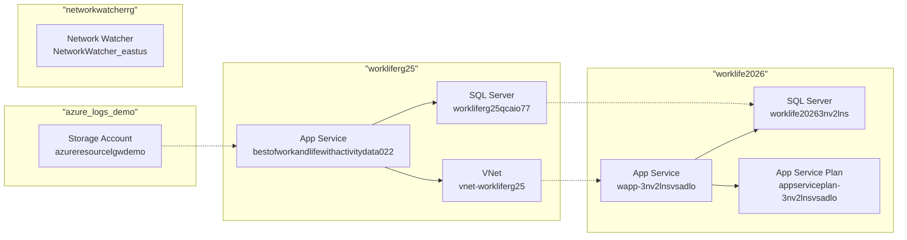

# Azure Architecture Document

## 1. Executive Summary

This Azure inventory shows two small application environments deployed in the same subscription:

- **workliferg25** in **centralus**
- **worklife2026** in **swedencentral**

The estate appears to support:
- A **web application** hosted on **Azure App Service**
- A **SQL Database** backend
- **Azure OpenAI / Azure AI Services**
- **Azure Container Registry**
- **Private DNS and VNet integration**
- **Log Analytics / Microsoft Defender for Cloud**
- Some **monitoring and network watcher** resources

The overall architecture is a **single-region, PaaS-heavy application platform** with some security and observability components. It is not fully standardized across environments, and there are several signs of **incomplete hardening**, **resource sprawl**, and **cross-region inconsistency**.

---

## 2. Environment Overview

### Subscription
- **Subscription ID:** `XXXXXXXX-XXXX-XXXX-XXXX-XXXXXXXXXXXX`

### Resource Groups
- `workliferg25`
- `worklife2026`
- `networkwatcherrg`
- `azure_logs_demo`

### Regions Used
- **centralus**
- **swedencentral**
- **eastus**
- **global**

### High-Level Pattern
The inventory suggests two related application stacks:
1. **Central US stack** in `workliferg25`
2. **Sweden Central stack** in `worklife2026`

Both stacks include:
- App Service plan
- Web app
- SQL server/database
- AI/Cognitive Services

This looks like either:
- a **dev/test + secondary environment** setup, or
- a **multi-region duplication** of the same solution

However, the configuration is not symmetrical and does not show a clear production-grade DR design.

---

## 3. Architecture by Resource Type

## 3.1 Azure AI Services / Azure OpenAI

### Resources
- `myAzFoundry-workliferg25` — `AIServices` in `centralus`
- `myAzFoundry-workliferg25/myAzFoundry-workliferg25-proj` — AI project in `centralus`
- `aoaiservice3nv2lnsvsadlo` — `OpenAI` in `swedencentral`

### Observations
- One AI Services account is deployed in **centralus**.
- One Azure OpenAI account is deployed in **swedencentral**.
- An AI project exists under the AI Services account, indicating use of **Azure AI Foundry / project-based AI development**.

### Architecture Pattern
- **PaaS AI integration**
- **Project-based AI development**
- Likely application-level consumption of Azure OpenAI or AI Services APIs

### Risks
- AI resources are split across regions without a documented reason.
- No evidence of private endpoints, network restrictions, or CMK.
- No tags on the AI Services resource, reducing governance visibility.
- Region mismatch may increase latency and complicate data residency.

### Best Practices Not Followed
- Standardize AI services in a single approved region unless business requirements justify otherwise.
- Apply consistent tagging.
- Restrict public network access where possible.
- Use managed identities and Key Vault for secrets and API access control.

---

## 3.2 Azure Container Registry

### Resources
- `workliferg25` — ACR in `swedencentral`
- `bestofworkandlifewithactivitydata022c08740` — ACR webhook in `swedencentral`

### Observations
- One container registry exists in the `workliferg25` resource group but is physically in **swedencentral**.
- A webhook is configured, likely to trigger downstream deployment on image push.

### Architecture Pattern
- **Container-based CI/CD**
- **Registry-driven deployment automation**

### Risks
- ACR is in a different region than the main app stack in `centralus`, which may increase pull latency.
- No evidence of private endpoint, firewall rules, or admin user settings.
- Webhook naming suggests auto-generated or partially managed configuration, which can be hard to govern.

### Best Practices Not Followed
- Keep ACR close to compute unless cross-region design is intentional.
- Disable admin user if not required.
- Use private link and network restrictions.
- Use consistent naming and tagging.

---

## 3.3 Networking

### Resources
- `vnet-workliferg25` — Virtual Network in `centralus`
- Private DNS zones:
  - `privatedns-workliferg25.local`
  - `privatelink.database.windows.net`
  - `privatelink.azurewebsites.net`
- VNet links:
  - `34297b6dc3608`
  - `tbsum6qz747vc`
  - `privatedns-workliferg25.local-vnetlink`

### Observations
- A VNet exists in `centralus`, suggesting private connectivity for app and data services.
- Private DNS zones indicate use of **Private Link** for:
  - Azure SQL
  - App Service
  - A custom internal zone (`workliferg25.local`)
- VNet links exist, but the inventory does not show:
  - subnets
  - NSGs
  - route tables
  - private endpoints
  - NAT gateway
  - VPN/ExpressRoute

### Architecture Pattern
- **Private DNS + VNet integration**
- **Hybrid-style private service resolution**
- Likely intended for **private endpoint-based PaaS access**

### Risks
- The presence of private DNS zones does not confirm that private endpoints are actually deployed.
- No subnet or NSG visibility means network segmentation cannot be validated.
- No hub-spoke or landing zone pattern is evident.
- Resource naming for VNet links is weak and non-descriptive.

### Best Practices Not Followed
- Document subnet purpose and isolate workloads by subnet.
- Use NSGs and route tables explicitly.
- Use private endpoints for SQL, App Service, Storage, ACR, and AI services where supported.
- Standardize naming for links and network resources.

---

## 3.4 Azure SQL

### Resources
- `worklife20263nv2lns` — SQL server in `swedencentral`
- `workliferg25qcaio77` — SQL server in `centralus`
- `aoaidb` — user database in both regions
- `master` — system database in both regions

### Observations
- Two SQL servers exist, one per environment/region.
- Each has a database named `aoaidb`, likely the application database.
- The `master` database is present as expected.
- No firewall, failover group, elastic pool, or private endpoint details are shown.

### Architecture Pattern
- **Single-database application backend**
- **Environment duplication across regions**

### Risks
- No evidence of high availability or geo-replication.
- No evidence of backup policy, TDE configuration, auditing, or Defender for SQL.
- SQL servers appear to be public PaaS resources unless private endpoints/firewall rules are configured elsewhere.
- The `provisioningState` is null for SQL resources, which may indicate incomplete inventory data or nonstandard state reporting.

### Best Practices Not Followed
- Use private endpoints and disable public access where possible.
- Enable auditing, Defender for SQL, and vulnerability assessment.
- Define backup retention and geo-redundancy according to RPO/RTO.
- Consider failover groups if this is production.

---

## 3.5 Azure App Service

### Resources
- `bestofworkandlifewithsportdata` — App Service Plan in `centralus`
- `appserviceplan-3nv2lnsvsadlo` — App Service Plan in `swedencentral`
- `bestofworkandlifewithactivitydata022` — Web App in `centralus`
- `wapp-3nv2lnsvsadlo` — Web App in `swedencentral`

### Observations
- Two Linux App Service Plans exist, both **Basic tier**:
  - `B2` in `centralus`
  - `B1` in `swedencentral`
- Two Linux web apps exist, one per region.
- One app name suggests container-based deployment:
  - `bestofworkandlifewithactivitydata022` has kind `app,linux,container`
- The other app is a standard Linux web app.

### Architecture Pattern
- **PaaS web hosting**
- **Regional app duplication**
- **Containerized web workload in one environment**

### Risks
- Basic tier is limited for production workloads.
- No autoscale evidence.
- No deployment slots visible.
- No zone redundancy.
- Cross-region app and data placement is inconsistent.
- Container app and non-container app may indicate different deployment models across environments.

### Best Practices Not Followed
- Use Standard or Premium tiers for production.
- Enable autoscale where applicable.
- Use deployment slots for safe releases.
- Standardize deployment model across environments.
- Use managed identity for app-to-database and app-to-AI access.

---

## 3.6 Azure Storage

### Resources
- `azureresourcelgwdemo` — Storage account in `centralus`

### Observations
- One storage account exists in the `azure_logs_demo` resource group.
- SKU is `Standard_LRS`, meaning locally redundant storage.

### Architecture Pattern
- **Supporting storage for logs or application data**

### Risks
- LRS provides only single-region durability.
- No evidence of private endpoint, firewall, encryption settings, lifecycle management, or diagnostic configuration.
- Resource group suggests this may be used for logging, but the inventory does not confirm usage.

### Best Practices Not Followed
- Use private access and restrict public network access.
- Consider GRS/ZRS depending on business continuity needs.
- Enable diagnostic settings and lifecycle policies.
- Confirm whether this is a logging, backup, or application storage account and govern accordingly.

---

## 3.7 Monitoring and Observability

### Resources
- `lgawkspcdemo2025` — Log Analytics Workspace in `centralus`
- `lawconfigchagedemo` — Log Analytics Workspace in `centralus`
- `XXXXXXXX-XXXX-XXXX-XXXX-XXXXXXXXXXXX` — Workbook in `eastus`
- `SecurityCenterFree(lgawkspcdemo2025)` — Defender for Cloud solution
- `Security(lgawkspcdemo2025)` — Defender for Cloud solution
- `ExportToWorkspace` — Security automation

### Observations
- At least two Log Analytics workspaces exist, which suggests split monitoring or multiple projects.
- Defender for Cloud is enabled through OMS solutions.
- A security automation named `ExportToWorkspace` suggests security findings are exported to Log Analytics.
- A workbook titled **Compliance Over Time** indicates compliance tracking.

### Architecture Pattern
- **Centralized monitoring**
- **Security posture management**
- **Compliance reporting**

### Risks
- Multiple Log Analytics workspaces can fragment telemetry and increase operational overhead.
- Workbook is in `eastus`, separate from the main workload regions.
- No evidence of Application Insights, alert rules, action groups, or diagnostic settings on workload resources.
- Security automation exists, but its scope and effectiveness are unknown.

### Best Practices Not Followed
- Consolidate monitoring where possible.
- Standardize diagnostic settings across all resources.
- Ensure App Service, SQL, ACR, AI, and networking logs are sent to the same operational model.
- Define alerting, dashboards, and incident response workflows.

---

## 3.8 Network Watcher

### Resources
- `NetworkWatcher_eastus`
- `NetworkWatcher_swedencentral`
- `NetworkWatcher_centralus`

### Observations
- Network Watcher exists in three regions.
- This is normal for Azure network diagnostics.

### Architecture Pattern
- **Regional network monitoring support**

### Risks
- None material from the inventory alone.
- Presence does not imply active use.

### Best Practices
- Keep Network Watcher enabled in regions where VNets exist.
- Use flow logs and connection troubleshoot where needed.

---

## 3.9 Azure Security / Automation

### Resources
- `ExportToWorkspace` — Microsoft Security automation

### Observations
- Security automation is configured, likely to export alerts or recommendations to Log Analytics.

### Risks
- No details on playbooks, triggers, or scope.
- Could be underused if not tied to operational response.

### Best Practices
- Tie security automation to incident workflows.
- Validate that alerts are actionable and routed to owners.

---

## 4. Architecture Patterns Identified

### 4.1 PaaS-First Application Architecture
The solution relies heavily on managed services:
- App Service
- SQL Database
- AI Services / OpenAI
- ACR
- Log Analytics

This reduces infrastructure management overhead and is aligned with cloud-native design.

### 4.2 Dual-Environment / Dual-Region Layout
Two similar stacks exist in:
- `centralus`
- `swedencentral`

This may represent:
- dev/test and another environment
- regional duplication
- migration staging

However, there is no clear evidence of a formal DR or active-active design.

### 4.3 Private DNS and Private Connectivity Intent
Private DNS zones for SQL and App Service indicate an intention to use private endpoints and internal name resolution.

### 4.4 Security and Compliance Monitoring
Defender for Cloud and Log Analytics indicate a baseline security monitoring posture.

---

## 5. Key Risks

## 5.1 Inconsistent Regional Design
Resources are spread across `centralus`, `swedencentral`, and `eastus` without a clear placement strategy.

**Impact:** latency, governance complexity, and unclear data residency.

## 5.2 Weak Production Hardening
App Service plans are Basic tier, SQL security posture is not visible, and no private endpoint details are shown.

**Impact:** limited scalability and possible exposure to public network access.

## 5.3 Fragmented Monitoring
Multiple Log Analytics workspaces and cross-region workbooks suggest telemetry fragmentation.

**Impact:** harder troubleshooting, inconsistent alerting, and duplicated operational effort.

## 5.4 Naming and Governance Inconsistency
Several resources have auto-generated or non-descriptive names.

**Impact:** poor maintainability and higher operational risk.

## 5.5 Missing Evidence of Network Segmentation
No subnet, NSG, route table, or private endpoint inventory is present.

**Impact:** cannot confirm isolation or zero-trust network controls.

## 5.6 Potential Resource Sprawl
There are multiple supporting resources that may be legacy, demo, or partially used.

**Impact:** cost leakage and governance drift.

---

## 6. Best Practices Not Being Followed

- **Consistent tagging** is missing on several resources.
- **Standardized naming** is not followed across all resource types.
- **Private access controls** are not visible for SQL, App Service, ACR, or AI services.
- **Production-grade App Service tiers** are not used.
- **Monitoring consolidation** is not in place.
- **Clear DR strategy** is not evident.
- **Network segmentation** is not documented or visible.
- **Resource group alignment** is inconsistent with regional placement.
- **Security baseline evidence** is incomplete for SQL and storage.

---

## 7. Recommended Target State

### 7.1 Application Platform
- Standardize on one deployment model:
  - container-based or code-based, not both unless intentional
- Use **App Service Standard/Premium**
- Enable **deployment slots**
- Use **managed identity** for all service-to-service access

### 7.2 Data Layer
- Use **private endpoints** for SQL
- Disable public network access where possible
- Enable auditing, Defender for SQL, and backup policy review
- Define HA/DR with failover groups if production

### 7.3 AI Layer
- Consolidate AI services into approved regions
- Use private access and identity-based authorization
- Apply governance tags and cost controls

### 7.4 Network
- Document subnets and NSGs
- Confirm private endpoint deployment
- Use hub-spoke if multiple workloads will be added
- Standardize DNS and link naming

### 7.5 Observability
- Consolidate Log Analytics workspaces where practical
- Enable diagnostic settings on all resources
- Add Application Insights for web apps
- Define alert rules and action groups

### 7.6 Governance
- Enforce tags: `environment`, `owner`, `application`, `costCenter`, `dataClassification`
- Apply Azure Policy for:
  - private endpoints
  - diagnostic settings
  - allowed regions
  - required tags
  - secure SQL and storage settings

---

## 8. Resource Inventory Summary

### By Resource Type
- **AI Services / OpenAI:** 3
- **Container Registry:** 2
- **Workbooks:** 1
- **Network Watchers:** 3
- **Private DNS Zones:** 3
- **Private DNS VNet Links:** 3
- **Virtual Networks:** 1
- **Log Analytics Workspaces:** 2
- **Defender for Cloud Solutions:** 2
- **Security Automation:** 1
- **SQL Servers:** 2
- **SQL Databases:** 4
- **Storage Accounts:** 1
- **App Service Plans:** 2
- **Web Apps:** 2

---

## 9. Conclusion

This Azure estate is a **small PaaS-based application environment** with clear intent toward private networking, security monitoring, and AI-enabled workloads. The main strengths are the use of managed services and the presence of monitoring/security components.

The main weaknesses are:
- inconsistent regional placement
- limited evidence of hardening
- fragmented observability
- weak governance consistency
- no visible production-grade resilience design

If this is a production workload, the current state should be treated as **functional but not fully hardened**. If it is a development or demo environment, it is acceptable but still needs governance cleanup and standardization.

If you want, I can turn this into a more formal document format next, such as:
1. **Solution Architecture**
2. **Security Architecture**
3. **Operations Runbook**
4. **Risk Register**
5. **Azure Policy recommendations**

---

## Architecture Diagram

