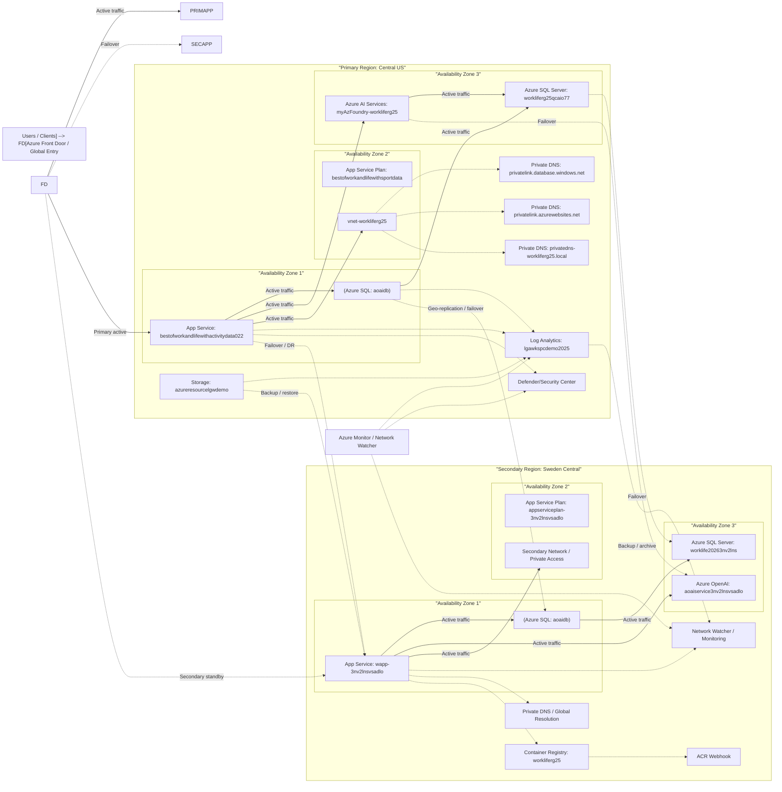

## BCDR and High Availability Assessment for Azure Inventory

### Executive summary
This environment has **some built-in platform resilience** through Azure-managed services, but overall **BCDR maturity is moderate to low** because most workloads appear deployed as **single-region, single-instance resources** with limited evidence of active-active or active-passive failover design. The largest risks are:

- **Region concentration** in **centralus** and **swedencentral**
- **Single-instance App Service, SQL, Storage, and AI resources**
- **No visible geo-redundant storage or database failover configuration**
- **No clear backup/restore or DR orchestration evidence**
- **Potential dependency on private DNS, VNet, and regional monitoring resources without secondary-region equivalents**

As a result, the current design likely supports **service continuity for localized component failures**, but **not strong regional disaster recovery**.

---

## 1) Redundancy and failover capabilities

### What is resilient today
Some Azure services provide inherent platform redundancy:
- **Azure SQL Database** is a managed PaaS service with built-in high availability within a region.
- **App Service Plans / Web Apps** benefit from Azure platform resiliency, but only if scaled out and configured properly.
- **Azure AI Services / OpenAI** are managed services with Microsoft-side infrastructure resilience, but customer-controlled failover is limited.
- **Network Watcher** and **Log Analytics** are not business-critical runtime dependencies, but they support operations and incident response.

### Gaps
Most resources are deployed as **single regional instances**:
- **App Services**: one app in **centralus**, one in **swedencentral**, no evidence of cross-region failover routing.
- **App Service Plans**: both are **Basic tier** and single-instance by default, which is not HA-ready.
- **SQL servers/databases**: one SQL server in each region, but no evidence of:
  - failover groups
  - geo-replication
  - auto-failover configuration
  - secondary readable replica
- **Storage account**: **Standard_LRS** only, which is **locally redundant** and vulnerable to a regional outage.
- **Azure Container Registry**: appears single-region with no geo-replication.
- **Azure AI/OpenAI**: single-region deployments only.

### Assessment
- **Intra-region resilience:** moderate for managed PaaS, low for app tier due to single-instance/basic SKU.
- **Inter-region failover:** weak to absent.
- **Automatic failover:** not evident for critical application/data tiers.

---

## 2) RTO/RPO gaps

Because no explicit DR configuration is visible, the likely recovery objectives are constrained by manual rebuild/restore processes.

### Likely current state
- **RTO**: likely **hours to days** for a full regional outage, depending on manual redeployment and data restore.
- **RPO**: likely **minutes to hours** for SQL if backups exist, but **unknown** for app/configuration and storage data.

### Key gaps
- No evidence of:
  - Azure Site Recovery
  - SQL failover groups
  - geo-backup/geo-restore strategy
  - backup vault / recovery services vault
  - app configuration backup/export
  - infrastructure-as-code recovery automation
- Storage uses **LRS**, so if the region is lost, data availability is impacted until restore from another source.
- App tier and ACR do not show secondary-region readiness, which increases rebuild time.

### Assessment
Current design likely does **not meet aggressive RTO/RPO targets** such as:
- **RTO < 1 hour**: unlikely
- **RPO near-zero**: unlikely
- **RTO 4–8 hours**: possible only with strong manual runbooks and backups
- **RPO 15–60 minutes**: possible only for SQL if backups/replication are configured, but not demonstrated

---

## 3) Single points of failure

### High-risk single points
1. **Storage account `azureresourcelgwdemo`**
   - SKU: **Standard_LRS**
   - Single-region, locally redundant only
   - Potential SPOF for logs or application data if used operationally

2. **App Service Plans**
   - **B1/B2 Basic tiers**
   - Typically limited HA capabilities
   - No evidence of scale-out or zone redundancy

3. **SQL databases**
   - Single database instances per region
   - No failover group or geo-replication visible
   - Database availability depends on regional service health

4. **Azure Container Registry**
   - Single-region registry
   - If the region is unavailable, image pulls and deployments may fail

5. **Private DNS / VNet dependencies**
   - Private DNS zones exist, but no secondary-region network architecture is visible
   - If applications depend on private endpoints, DNS and network failover must be designed explicitly

6. **Operational dependencies in centralus**
   - Log Analytics workspace, security solutions, storage, and one app stack are concentrated in **centralus**
   - A regional outage would affect observability and possibly incident response

### Assessment
The environment has **multiple SPOFs at the service and region level**, especially for data, application hosting, and deployment artifacts.

---

## 4) Multi-region readiness

### Current state
The inventory shows resources in **centralus** and **swedencentral**, which is a positive sign, but this does **not automatically mean multi-region DR**.

### What is missing for true multi-region readiness
- **Traffic management**:
  - Azure Front Door or Traffic Manager not visible
- **Data replication**:
  - SQL failover groups / geo-replication not visible
  - Storage GRS/GZRS not visible
  - ACR geo-replication not visible
- **Application deployment parity**:
  - App Service exists in both regions, but no evidence of active-active routing or synchronized deployment pipelines
- **Network parity**:
  - Only one VNet is visible, in **centralus**
  - No secondary VNet or hub/spoke DR network in swedencentral
- **Secrets/configuration**:
  - No Key Vault shown
  - No evidence of replicated configuration or identity dependencies being DR-ready

### Assessment
The environment is **multi-region present**, but **not multi-region ready** from a failover perspective.

---

## 5) Backup coverage

### What is visible
- No Recovery Services Vault
- No Backup Vault
- No Azure Backup protected items
- No SQL long-term retention configuration visible
- No storage backup or versioning configuration visible
- No app backup/export configuration visible

### Implications
- If a workload is deleted, corrupted, or regionally impacted, recovery may depend on:
  - native service backups
  - manual redeployment
  - source code / IaC
  - database restore from default retention windows

### Assessment
Backup coverage is **not demonstrated** in the inventory and should be treated as a **material risk** until confirmed.

---

## 6) SLA implications

### Important note
Azure SLAs are only meaningful when the service is deployed in a way that qualifies for them. Several resources here are on lower tiers or single-instance configurations that reduce practical availability.

### Likely SLA concerns
- **App Service Basic tier**:
  - Lower availability posture than Standard/Premium with scale-out and zone redundancy options
  - Not ideal for business-critical workloads
- **Standard_LRS storage**:
  - Protects against node failure, not regional disaster
- **Single SQL database without failover group**:
  - SLA may exist for the service, but **business continuity SLA** is weak without geo-failover
- **AI/OpenAI single-region**:
  - Service availability depends on regional service health and Microsoft-side capacity

### Business impact
Even if individual services have platform SLAs, the **end-to-end application SLA** is likely lower because:
- there is no visible multi-region failover path
- dependencies are not duplicated
- recovery is likely manual

---

# Prioritized recommendations

## Priority 1 — Protect data and enable regional recovery
**Business impact: Critical**

1. **Upgrade storage from LRS to GRS or GZRS**
   - For operational or application data, move from **Standard_LRS** to **GRS/GZRS** where supported.
   - If this storage is for logs only, confirm retention and export strategy.

2. **Configure SQL geo-replication or auto-failover groups**
   - For the `aoaidb` database, implement:
     - **Auto-failover group** between centralus and swedencentral, or
     - **Active geo-replication**
   - Define clear RPO/RTO targets and test failover.

3. **Implement backup strategy**
   - Create a **Recovery Services Vault / Backup Vault** where applicable.
   - Confirm:
     - SQL backup retention
     - point-in-time restore
     - long-term retention if required
     - backup immutability / soft delete where supported

4. **Back up application configuration and infrastructure as code**
   - Ensure all resources are deployable from **Bicep/Terraform**.
   - Store app settings, connection strings, and deployment configs in source-controlled templates.

---

## Priority 2 — Remove application single points of failure
**Business impact: High**

5. **Move App Service Plans from Basic to Standard or Premium**
   - Basic tier is not ideal for HA/DR.
   - Use **Standard/Premium** to support:
     - scale-out
     - deployment slots
     - better resiliency options
     - zone redundancy where supported

6. **Deploy active-passive or active-active web architecture**
   - Use **Azure Front Door** or **Traffic Manager** for global routing and health-based failover.
   - Deploy the web app in both regions with synchronized releases.

7. **Replicate ACR across regions**
   - Enable **ACR geo-replication** or use a multi-region image distribution strategy.
   - This prevents deployment failure during a regional outage.

---

## Priority 3 — Build a real multi-region network and DNS design
**Business impact: High**

8. **Create a secondary-region VNet**
   - The current VNet is only visible in **centralus**.
   - Build a matching network in **swedencentral** with:
     - subnets
     - private endpoints
     - NSGs
     - route tables
     - DNS integration

9. **Design private DNS failover**
   - Review private DNS zones:
     - `privatelink.database.windows.net`
     - `privatelink.azurewebsites.net`
   - Ensure private endpoints and DNS records support both regions.
   - Validate name resolution during failover.

10. **Document dependency mapping**
   - Identify which apps depend on:
     - SQL
     - private endpoints
     - ACR
     - AI services
     - Log Analytics
   - Build a dependency-aware failover runbook.

---

## Priority 4 — Improve operational resilience and recovery testing
**Business impact: Medium**

11. **Establish DR runbooks and test them**
   - Define:
     - failover steps
     - failback steps
     - validation checks
     - communication plan
   - Run at least quarterly DR tests.

12. **Set explicit RTO/RPO targets**
   - Example:
     - Tier 1 apps: RTO 1 hour, RPO 15 minutes
     - Tier 2 apps: RTO 4 hours, RPO 1 hour
   - Align architecture and cost to business criticality.

13. **Centralize monitoring in a resilient design**
   - Log Analytics is currently in **centralus**.
   - Consider a secondary workspace or export strategy for critical logs.
   - Ensure incident response remains possible during a regional outage.

---

## Priority 5 — Harden AI and platform services
**Business impact: Medium**

14. **Review AI/OpenAI regional dependency**
   - The AI services are single-region.
   - If the application depends on them for core workflows, define fallback behavior:
     - alternate region
     - degraded mode
     - queue-and-retry
     - cached responses where appropriate

15. **Confirm service quotas and regional capacity**
   - For OpenAI and AI Services, validate:
     - quota availability
     - deployment region support
     - recovery options if the region is unavailable

---

# Risk summary

## Overall risk rating: High
The environment appears functional, but **not resilient enough for a major regional outage** without significant manual intervention.

### Main reasons
- Single-region data and app dependencies
- No visible automated failover
- LRS storage
- Basic App Service tiers
- No visible backup vault or DR orchestration
- No traffic manager/front door layer

---

# Suggested target architecture

A stronger BCDR design would include:
- **Azure Front Door** for global routing
- **App Service in two regions**
- **SQL failover group**
- **GZRS/GRS storage**
- **ACR geo-replication**
- **Secondary VNet and private endpoints**
- **Backup vault / recovery vault**
- **IaC-based redeployment**
- **Quarterly DR testing**

---

# Final conclusion
This Azure estate shows **partial geographic distribution** but **insufficient resilience engineering** for robust BCDR. The biggest gap is that resources exist in two regions, yet there is **no evidence of coordinated failover, replicated data, or tested recovery procedures**. The highest-value improvements are to **replicate data, enable automated failover, upgrade app tiers, and implement a tested DR plan**.

If you want, I can also turn this into:
1. a **formal executive report**,  
2. a **risk register table**, or  
3. a **prioritized remediation roadmap with effort/impact scoring**.

---

## Architecture Diagram

