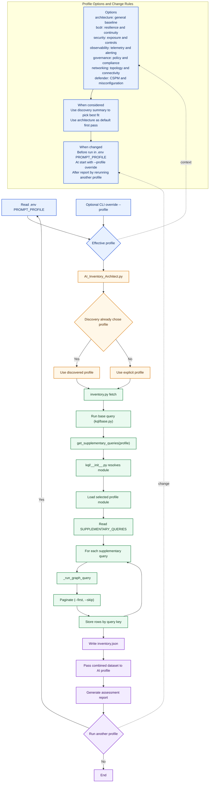
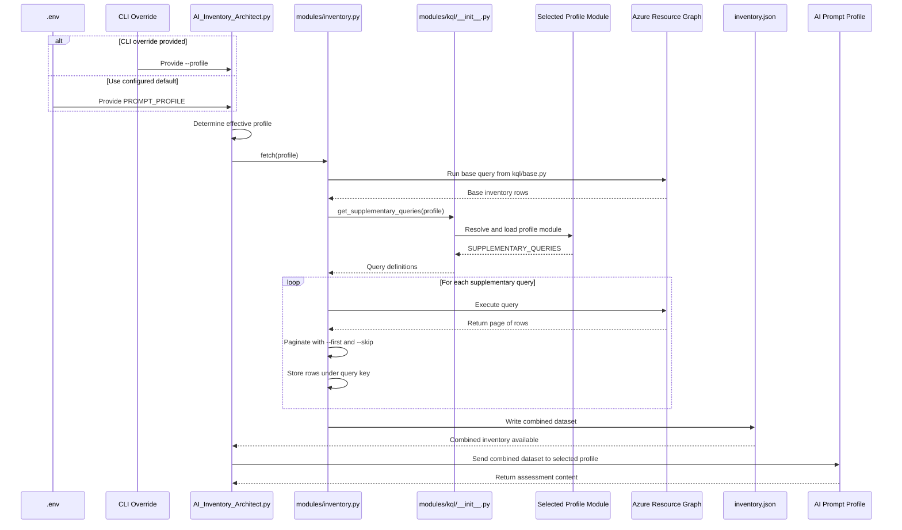

# KQL Technical Reference

## Purpose

This folder is the query framework for AzurePrism. It separates shared Azure Resource Graph collection from profile-specific supplementary collection so that each use case can reuse a common inventory baseline while adding narrowly scoped evidence for a deeper assessment.

In this proof of concept, KQL is not treated as an isolated reporting artifact. It is the acquisition layer that shapes what the AI model can reason about, what the CSV can normalize, and what each prompt profile can legitimately claim in the generated documentation.

## Framework Positioning

The KQL modules form a small routing framework rather than a loose set of query snippets. The framework has three responsibilities: define shared collection scope, map a selected profile to supplementary query groups, and execute each query with consistent pagination and output persistence.

### Call Flow by Profile Selection

1. The active profile is selected through `PROMPT_PROFILE` in `.env`, or overridden by the CLI `--profile` flag.
2. The orchestration entry point in `AI_Inventory_Architect.py` decides which deep-dive use case to run after discovery, or accepts the explicit profile directly.
3. `modules/inventory.py` always executes the shared base inventory query from `modules/kql/base.py`.
4. `modules/inventory.py` then requests supplementary queries by calling `modules.kql.get_supplementary_queries(profile)`.
5. `modules/kql/__init__.py` resolves the profile name to a concrete Python module path such as `modules.kql.security` or `modules.kql.networking`.
6. The selected module exposes a `SUPPLEMENTARY_QUERIES` list, where each item declares a logical `key`, a target Azure Resource Graph `table`, and the actual KQL `query` string.
7. `modules/inventory.py` runs each query independently through `_run_graph_query`, paginates results, and stores the returned records under the corresponding `key` in `inventory.json`.
8. The resulting combined dataset becomes the factual substrate used by the selected AI prompt profile.

### Sequence View for Technical Readers

The flowchart above is the best high-level orientation view because it shows profile choice, decision points, and rerun loops in a way that is easy to scan. The sequence diagram below complements that view by showing runtime responsibility more explicitly, which is especially valuable for developers, maintainers, and architects who want to understand which component calls which other component and in what order.

Use this second diagram when the audience needs to trace orchestration behavior rather than only understand process flow. It makes the interactions between configuration, orchestration, query registry resolution, profile-specific KQL loading, Azure Resource Graph execution, and output persistence more concrete.

### Discovery Versus Deep-Dive Profiles

Discovery is intentionally separate from the deep-dive profiles. `modules/kql/discovery.py` returns compact aggregate result sets that remain stable at tenant scale, while the deep-dive profile modules return supplemental evidence designed to enrich the full inventory collected in phase 2.

### Why the Framework Matters

This design creates a clean boundary between query intent and orchestration logic. It allows maintainers to extend analytical coverage by adding or refining profile modules without rewriting the collection loop, the export format, or the AI prompt execution path.

## Query Design Principles in This POC

The current modules favor readable, auditable queries over maximal normalization or advanced optimization. That bias is appropriate for a proof of concept because it keeps the lineage between Azure Resource Graph data, JSON output, CSV export, and AI interpretation transparent.

The dominant patterns used across this folder are:

- `where` to scope resource types or identify risky states.
- `project` to shape the payload and reduce unnecessary columns.
- `extend` to derive interpretable fields from nested properties.
- `summarize` for discovery or posture rollups.
- `mv-expand` for nested arrays such as NSG rules or permissions.

## Shared Query Foundation

### Base Inventory Query

The base inventory query is the common denominator for every deep-dive profile. Its value is breadth: it captures a tenant-wide resource baseline before any domain-specific enrichment is added.

File: `modules/kql/base.py`

Definition: The query reads from the `Resources` table and projects core metadata for every discovered Azure resource. It retains the full `properties` payload so later consumers still have access to nested details without needing a second generic pass.

Query anatomy:

- `Resources`: selects the standard Azure Resource Graph table that contains most ARM resource types.
- `project id, name, type, location, resourceGroup, subscriptionId, tags, sku, kind, identity, provisioningState = properties.provisioningState, properties`: keeps the columns most useful for cross-profile analysis and preserves the full resource document.
- `order by type asc`: provides deterministic grouping in the exported JSON and makes manual review easier.

Limitations:

- The query is broad and intentionally shallow; it does not normalize every service-specific property.
- Retaining the full `properties` object increases payload size, which can become material in large estates.
- Resources that require specialized tables for rich posture data are not fully represented by this query alone.

POC value: This query is the shared factual baseline that allows every profile to reason from the same resource snapshot. It is especially valuable for architecture-wide pattern detection, resource counting, region distribution review, and prompt consistency across different analysis modes.

Scale review: This is the most expensive logical query in the framework because it touches the widest resource set. The current pagination approach in `modules/inventory.py` is appropriate for moderate estates, but very large tenants may require subscription scoping, partitioned execution, or selective projection to reduce payload volume.

PitStop expansion ideas:

- Add optional subscription filters for delegated runs.
- Add `type`-family sampling modes for faster exploratory execution.
- Introduce selective property flattening for high-value services to reduce downstream parsing cost.

## Phase 1 Discovery Group

The discovery group is the framework's intake layer for unknown environments. Its value comes from fixed-size, aggregate summaries that remain interpretable before the system commits to a heavier deep-dive collection pass.

File: `modules/kql/discovery.py`

### Intent and Value

These queries are optimized to answer: what exists, where it exists, and what profile should be run next. They are highly suitable for first contact with a tenant, governance triage, and operator decision support when the environment scale is not yet known.

### Query: `totals`

Definition: An estate-wide rollup over `Resources` that counts total resources, distinct resource groups, distinct subscriptions, and distinct regions.

Query anatomy:

- `summarize resource_count = count()`: counts all returned resources.
- `resource_group_count = dcount(resourceGroup)`: counts distinct resource groups.
- `subscription_count = dcount(subscriptionId)`: counts tenant subscription breadth.
- `region_count = dcount(location)`: estimates deployment spread across regions.

Limitations:

- It measures cardinality, not criticality.
- It does not distinguish production from non-production assets.

POC value: This is the fastest executive indicator of estate size and complexity. It is useful as a routing input for the environment brief and for judging whether a narrow or broad deep-dive is warranted.

Scale review: This query scales well because it returns a single aggregate row. The underlying scan still spans the `Resources` table, so extremely large estates may still benefit from subscription segmentation if responsiveness becomes an issue.

PitStop expansion ideas:

- Add counts by management group if tenancy hierarchy matters.
- Add counts by environment tag when tagging quality improves.

### Query: `by_type`

Definition: A top-30 rollup of resources by ARM type.

Query anatomy:

- `summarize count_ = count() by type`: groups all resources by ARM type.
- `order by count_ desc`: ranks the dominant types first.
- `take 30`: bounds the result set for predictable prompt input size.

Limitations:

- Long-tail resource diversity is truncated after the top 30 types.
- It does not classify resources into business-capability groupings.

POC value: This query reveals whether the tenant is compute-heavy, network-heavy, data-heavy, or skewed toward platform services. It is a practical signal for recommending architecture, networking, observability, or security as the next deep-dive profile.

Scale review: The query is robust at scale because the output is bounded. Cardinality can still become high in heterogeneous tenants, so the `take 30` guard is important for keeping the discovery brief stable.

PitStop expansion ideas:

- Add mapping from ARM types to service categories.
- Add a parallel version grouped by provider namespace for executive reporting.

### Query: `by_region`

Definition: A region distribution summary across all resources.

Query anatomy:

- `summarize count_ = count() by location`: groups resource counts by Azure region.
- `order by count_ desc`: shows the densest regions first.

Limitations:

- Global resources may have ambiguous or null location semantics.
- Count concentration does not necessarily imply business criticality concentration.

POC value: Useful for identifying regional concentration, early BCDR concerns, and multi-region footprint maturity. It also supports architecture narratives about geographic deployment patterns.

Scale review: This query scales well because region cardinality is naturally low. The main caveat is interpretive, not computational: some services report location differently than region-bound resources.

PitStop expansion ideas:

- Add normalized handling for global services.
- Add paired-region inference for resilience assessments.

### Query: `by_resource_group`

Definition: A top-50 rollup of resource counts by resource group and subscription.

Query anatomy:

- `summarize count_ = count() by resourceGroup, subscriptionId`: captures density at resource-group granularity.
- `order by count_ desc`: highlights the most populated groups first.
- `take 50`: caps output size for discovery efficiency.

Limitations:

- Large groups may mix unrelated workloads.
- Smaller but business-critical groups may be omitted from the top 50.

POC value: This query is useful for spotting consolidation patterns, monolithic resource groups, and likely governance hotspots. It also helps frame architecture and governance reviews by identifying where configuration concentration exists.

Scale review: The result remains bounded by design. In tenants with many resource groups, `take 50` preserves performance and prompt budget but sacrifices full coverage.

PitStop expansion ideas:

- Add tag-aware grouping to separate environments or business units.
- Add companion metrics such as distinct resource types per resource group.

### Query: `by_subscription`

Definition: An aggregate view of resource count and resource-group count by subscription.

Query anatomy:

- `summarize count_ = count(), rg_count = dcount(resourceGroup) by subscriptionId`: creates a subscription-level footprint summary.
- `order by count_ desc`: ranks subscriptions by size.

Limitations:

- Subscription purpose is not inferred.
- It does not expose policy, billing, or management-group context.

POC value: Useful for multi-subscription posture assessment and early governance triage. It supports decisions on whether to pivot into governance, security, or architecture next.

Scale review: The query scales well because most tenants have manageable subscription cardinality. Interpretation becomes harder when subscription naming or ownership conventions are weak.

PitStop expansion ideas:

- Join to management group context when available.
- Add owner metadata from tags or external CMDB enrichment.

### Query: `by_sku`

Definition: A top-30 summary of resources grouped by type and SKU name.

Query anatomy:

- `where isnotempty(sku)`: excludes resources that do not expose SKU metadata.
- `summarize count_ = count() by type, sku_name = tostring(sku.name)`: counts resource/SKU combinations.
- `order by count_ desc | take 30`: returns the dominant patterns only.

Limitations:

- Many resource types do not provide a populated SKU field.
- It does not interpret cost, performance tier, or supportability implications directly.

POC value: Helpful for pattern spotting in compute tiers, storage tiers, and service standardization. It can reveal whether the environment uses a narrow set of repeatable SKUs or a fragmented deployment pattern.

Scale review: The output is bounded, but SKU diversity can still be high in heterogeneous estates. This query remains suitable for discovery because it trades completeness for a stable signal.

PitStop expansion ideas:

- Map SKUs to cost or resiliency heuristics.
- Add workload-specific SKU reviews for compute or database profiles.

### Query: `by_provisioning_state`

Definition: An aggregate count by provisioning state derived from `properties.provisioningState`.

Query anatomy:

- `summarize count_ = count() by provisioningState = tostring(properties.provisioningState)`: groups resources by lifecycle state.

Limitations:

- Not all services use provisioning state consistently.
- It does not explain why a resource is in a failed or transitional state.

POC value: This query is valuable for highlighting operational anomalies before deeper assessment. It provides early evidence that architecture or observability follow-up may be warranted.

Scale review: This query is computationally light in output size and scales well. Its main limitation is semantic inconsistency across providers.

PitStop expansion ideas:

- Add a filter for failed or non-terminal states only.
- Add type-level breakdowns for failed resources.

## Architecture Profile Group

The architecture profile extends the base inventory with structural context rather than risk posture. Its value is to make deployment topology, grouping conventions, and configuration framing more legible to architects reviewing the environment as a system.

File: `modules/kql/architecture.py`

### Query: `resource_containers`

Definition: A query over `ResourceContainers` that returns resource group objects with their location, tags, and properties.

Query anatomy:

- `ResourceContainers`: switches from resource instances to container metadata.
- `where type =~ 'microsoft.resources/subscriptions/resourcegroups'`: scopes the query to resource groups.
- `project name, location, tags, properties`: preserves naming, regional hints, tagging metadata, and remaining container details.

Limitations:

- Resource groups do not expose workload relationships by themselves.
- The query does not retrieve management group lineage or lock information.

POC value: Useful for documenting grouping strategies, naming standards, and tag quality. It gives the architecture narrative a container-aware view that complements the base resource inventory.

Scale review: This query scales well because resource group counts are materially lower than resource counts in most estates. The payload remains modest unless tags or properties are unusually dense.

PitStop expansion ideas:

- Add management lock inspection.
- Add joins between resource groups and dominant service families.

## BCDR Profile Group

The BCDR profile focuses on resilience signals rather than full continuity proof. Its value is to expose whether the estate shows tangible evidence of backup, replication, failover, and workload availability constructs.

File: `modules/kql/bcdr.py`

### Query: `recovery_vaults`

Definition: An inventory of Recovery Services vaults from the `Resources` table.

Query anatomy:

- Filters to `microsoft.recoveryservices/vaults`.
- Projects identity, type, location, resource group, SKU, and properties for resilience review.

Limitations:

- Presence of a vault does not guarantee protection coverage.
- It does not establish backup policy quality on its own.

POC value: Useful as the first signal of formal backup tooling in the estate. It supports resilience maturity discussions and frames whether backup data exists to investigate further.

Scale review: Vault counts are usually low, so this query is cheap to run. The main scaling concern is interpretive depth rather than runtime cost.

PitStop expansion ideas:

- Add vault redundancy settings.
- Add backup policy metadata where available.

### Query: `backup_items`

Definition: An inventory of protected backup items from `RecoveryServicesResources`.

Query anatomy:

- Uses the specialized `RecoveryServicesResources` table.
- Filters to protected items beneath vault fabrics and protection containers.
- Projects identifying metadata and `properties` for detailed backup context.

Limitations:

- The nested type path is service-specific and may be harder to normalize.
- It does not by itself calculate coverage percentage against all protectable assets.

POC value: This is one of the most direct resilience signals in the BCDR profile because it shows actual protected entities. It is valuable for distinguishing backup capability from backup implementation.

Scale review: Large backup estates can produce substantial row counts. Pagination is important here, and future implementations may need workload-type filters to keep runs predictable.

PitStop expansion ideas:

- Cross-check protected items against VMs, databases, or storage assets from the base inventory.
- Derive approximate protection coverage ratios.

### Query: `sql_failover_groups`

Definition: An inventory of SQL failover groups from the `Resources` table.

Query anatomy:

- Filters to `microsoft.sql/servers/failovergroups`.
- Projects name, resource group, location, and properties for failover review.

Limitations:

- Only addresses a specific data-platform resiliency pattern.
- It does not validate failover readiness or replication health.

POC value: Useful for identifying whether structured database failover constructs exist at all. It is especially relevant in estates where SQL platforms are business-critical.

Scale review: Failover group counts are usually small. The main consideration is completeness, not performance.

PitStop expansion ideas:

- Add Azure SQL geo-replication posture.
- Add business continuity coverage for managed database services beyond SQL.

### Query: `storage_replication`

Definition: An inventory of storage accounts with selected replication-related fields.

Query anatomy:

- Filters to storage accounts.
- Projects SKU, access tier, and secondary location alongside core metadata.

Limitations:

- Secondary location alone does not fully express replication guarantees.
- It does not classify SKU semantics into LRS, ZRS, GRS, or RA-GRS narratives explicitly.

POC value: Useful for quick review of storage durability posture and geographic redundancy clues. It gives the BCDR prompt concrete evidence for storage-level resilience commentary.

Scale review: Storage account counts are typically moderate and query cost is manageable. Payload size stays reasonable because the projection is selective.

PitStop expansion ideas:

- Derive redundancy classes directly from SKU.
- Flag storage workloads with single-region-only replication.

### Query: `vm_availability`

Definition: A virtual machine availability view that exposes zones, availability set references, and VM size.

Query anatomy:

- Filters to virtual machines.
- Projects zone placement, availability-set linkage, and hardware profile size.

Limitations:

- It does not prove actual workload redundancy across instances.
- Availability sets and zones are infrastructure indicators, not full application continuity evidence.

POC value: Useful for spotting obvious single-instance or single-zone deployment patterns. It supports resilience conversations around compute placement and failure-domain diversity.

Scale review: Large VM estates can return many rows, but the projected payload is compact. Scale pressure is moderate and generally acceptable with paging.

PitStop expansion ideas:

- Add virtual machine scale set resiliency review.
- Add joins to load balancers or application gateways to evaluate active distribution patterns.

## Security Profile Group

The security profile adds posture evidence about exposure, unhealthy findings, and protective control gaps. Its value is to move beyond generic inventory and surface targeted indicators that map naturally to remediation-oriented assessment.

File: `modules/kql/security.py`

### Query: `security_assessments`

Definition: An extraction of unhealthy Defender-related security assessments from `SecurityResources`.

Query anatomy:

- Filters to `microsoft.security/assessments`.
- Narrows to rows where `properties.status.code` is `Unhealthy`.
- Projects severity, display name, and assessed resource identifier.

Limitations:

- Depends on SecurityResources availability and appropriate access.
- It reflects surfaced assessment state, not necessarily the raw configuration root cause.

POC value: This is high-value evidence because it imports platform-native security findings into the profile. It is particularly useful for prioritization and for separating theoretical risks from service-detected weaknesses.

Scale review: Assessment volume can grow substantially in large estates. The query remains practical because it filters to unhealthy findings only.

PitStop expansion ideas:

- Add secure score trend context.
- Group findings by control family or resource type.

### Query: `nsg_rules` in Security

Definition: An NSG inventory with raw security rules preserved under a projected `rules` column.

Query anatomy:

- Filters to network security groups.
- Projects location and full `properties.securityRules` arrays.

Limitations:

- The raw rule array requires downstream interpretation.
- It does not directly classify permissive or risky rules in this profile.

POC value: Useful as primary evidence for network exposure analysis and segmentation review. It gives the AI layer enough structured material to discuss ingress and egress patterns, even without a more advanced rule-normalization pass.

Scale review: The row count may be moderate, but each row can be wide due to nested rule arrays. Large, heavily segmented environments may experience larger payloads.

PitStop expansion ideas:

- Use `mv-expand` to normalize one rule per row.
- Score high-risk ports, wildcard sources, or internet exposure explicitly.

### Query: `public_ips`

Definition: An inventory of public IP resources and their associated configurations.

Query anatomy:

- Filters to public IP address resources.
- Projects address, location, and referenced association.

Limitations:

- Association paths may still need extra parsing.
- A public IP alone does not reveal whether the attached service is intentionally exposed or adequately protected.

POC value: Useful for attack-surface enumeration and prioritizing internet-facing review. It is especially applicable when the proof of concept is used for initial exposure triage.

Scale review: Public IP counts are generally manageable. Interpretation becomes more complex than runtime when many IPs are indirect dependencies of gateways or load balancers.

PitStop expansion ideas:

- Resolve attached resource types directly.
- Differentiate active exposure from reserved but unused public IPs.

### Query: `key_vaults`

Definition: An inventory of Key Vaults with data-protection and network ACL fields.

Query anatomy:

- Filters to `microsoft.keyvault/vaults`.
- Projects soft-delete, purge-protection, and network ACL configuration.

Limitations:

- It does not inspect RBAC assignments or secret hygiene.
- ACL objects still require interpretation to determine true exposure posture.

POC value: Useful for assessing baseline secrets-governance maturity and data-protection defaults. It gives the security prompt concrete evidence for discussing vault hardening quality.

Scale review: Key Vault counts are usually modest, so runtime is low. The main risk is incomplete posture interpretation if downstream logic does not parse ACL details deeply.

PitStop expansion ideas:

- Add private endpoint coverage checks.
- Add RBAC versus access-policy mode analysis.

## Observability Profile Group

The observability profile is designed to infer telemetry maturity from Azure control-plane evidence. Its value is to identify where monitoring architecture exists, where it is fragmented, and where critical blind spots are likely.

File: `modules/kql/observability.py`

### Query: `diagnostic_settings`

Definition: A summarized estimate of diagnostic-settings presence by resource type.

Query anatomy:

- Excludes several resource types that would distort the signal.
- `extend hasDiag = isnotnull(properties.diagnosticSettings)`: derives a boolean marker.
- `summarize total = count(), withDiag = countif(hasDiag) by type`: counts monitored versus unmonitored resources per type.
- `extend withoutDiag = total - withDiag`: creates a practical gap metric.

Limitations:

- Diagnostic settings are not always exposed uniformly in `properties`.
- This is a heuristic and may undercount or misrepresent coverage for some services.

POC value: Very useful for quickly expressing telemetry blind spots at a service-family level. It gives the observability narrative a coverage-oriented anchor even without joining to dedicated diagnostics tables.

Scale review: This query scales reasonably because the output is summarized by type. The scan may still be broad because it evaluates much of the `Resources` table.

PitStop expansion ideas:

- Query dedicated diagnostics resources where supported.
- Add per-destination analysis for Log Analytics, Storage, and Event Hub.

### Query: `log_analytics_workspaces`

Definition: An inventory of Log Analytics workspaces with location, SKU, and retention data.

Query anatomy:

- Filters to Operational Insights workspaces.
- Projects workspace SKU and retention settings for topology and governance review.

Limitations:

- It does not show actual ingestion sources or daily volume.
- Cross-workspace relationships are inferred, not proven.

POC value: Useful for workspace-topology discussion, retention governance, and consolidation review. It is central when assessing whether the tenant has a coherent observability landing zone.

Scale review: Workspace counts are usually low. The query is cheap and highly interpretable.

PitStop expansion ideas:

- Add data collection rule associations.
- Add cross-subscription workspace centralization analysis.

### Query: `app_insights`

Definition: An inventory of Application Insights components and selected retention or ingestion settings.

Query anatomy:

- Filters to Insights components.
- Projects kind, ingestion mode, and retention days.

Limitations:

- It does not verify application instrumentation quality.
- It does not indicate whether sampling or availability tests are configured beyond exposed fields.

POC value: Useful for identifying where application-level observability likely exists. It helps distinguish infrastructure monitoring from application telemetry maturity.

Scale review: Counts are usually modest and runtime is low. Interpretive limits are greater than performance limits.

PitStop expansion ideas:

- Add workspace-based versus classic mode classification.
- Add application-to-component relationship resolution.

### Query: `alert_rules`

Definition: An inventory of key Azure Monitor alert rule types.

Query anatomy:

- Filters to metric alerts, scheduled query rules, and activity log alerts.
- Projects enabled state and severity for coverage review.

Limitations:

- It does not reveal scope breadth, condition quality, or action bindings.
- Alert volume alone can overstate effective monitoring maturity.

POC value: Useful for answering whether formal alerting exists and at what apparent severity mix. It provides a minimum viable signal for proactive monitoring posture.

Scale review: The query scales well because alert rule counts are generally moderate. The next maturity step is not performance optimization but semantic enrichment.

PitStop expansion ideas:

- Add scoping analysis by resource type.
- Add dormant or disabled alert reviews.

### Query: `action_groups`

Definition: An inventory of notification/action groups with receiver counts by channel.

Query anatomy:

- Filters to action groups.
- Projects whether the group is enabled and counts email, SMS, and webhook receivers.

Limitations:

- Receiver counts do not prove that escalation paths are valid or monitored.
- It does not show who owns the notification pathways.

POC value: Useful for evaluating notification readiness and whether alerts have plausible outbound routing. It is valuable for observability maturity discussions and on-call process inference.

Scale review: Counts are small and performance is trivial. Interpretation benefits from later joins to alert rules.

PitStop expansion ideas:

- Join action groups to alert rules.
- Add secure webhook versus email-heavy posture heuristics.

### Query: `network_watchers`

Definition: An inventory of Network Watcher instances by region.

Query anatomy:

- Filters to network watchers.
- Projects region and provisioning state.

Limitations:

- Presence of Network Watcher does not prove flow logs or connection monitoring are active.
- It is a foundational signal, not complete network observability evidence.

POC value: Useful for checking whether basic Azure network diagnostics scaffolding exists. It supports network-monitoring sections in the observability report.

Scale review: The query is lightweight because watcher counts are low. Regional completeness matters more than raw runtime.

PitStop expansion ideas:

- Add NSG flow log coverage.
- Add Connection Monitor and Traffic Analytics review.

### Query: `vm_extensions`

Definition: An inventory of monitoring-related VM extensions for Azure Monitor Agent and legacy agents.

Query anatomy:

- Filters to VM extensions.
- Restricts names to Azure Monitor Agent and legacy monitoring agent extensions.
- Extracts the parent VM name from the ARM resource ID.
- Projects publisher and agent type for upgrade-path review.

Limitations:

- It only checks extension presence, not health or data flow.
- The query reflects a curated set of agent names and may miss other collection patterns.

POC value: Useful for detecting monitoring rollout maturity across VMs and identifying legacy-agent debt. It is highly applicable where migration from MMA or OMS agents is still in progress.

Scale review: Large VM estates can produce substantial extension rows, but the projection remains compact. The main scale concern is volume, not query complexity.

PitStop expansion ideas:

- Join to data collection rules.
- Add policy-based agent deployment compliance checks.

## Governance Profile Group

The governance profile concentrates on policy non-compliance and container metadata. Its value is to expose whether the estate demonstrates enforceable governance, not merely descriptive tagging or naming conventions.

File: `modules/kql/governance.py`

### Query: `policy_compliance`

Definition: An extraction of non-compliant policy states from `PolicyResources`.

Query anatomy:

- Uses the specialized policy table.
- Filters to `microsoft.policyinsights/policystates`.
- Narrows to rows where `properties.complianceState` is `NonCompliant`.
- Projects policy definition name and impacted resource group.

Limitations:

- It captures state but not remediation ownership or exemption rationale.
- Availability depends on policy insight access and ARG exposure.

POC value: This is one of the strongest governance signals in the framework because it reflects enforceable control violations rather than soft conventions. It is valuable for prioritizing governance debt with direct evidence.

Scale review: Large policy estates can generate many rows. Filtering to non-compliant items keeps the result focused, but further summarization may be needed at enterprise scale.

PitStop expansion ideas:

- Summarize by initiative, policy assignment, or severity.
- Add exemption and remediation-task context.

### Query: `resource_groups`

Definition: A resource-group metadata query reused in a governance context.

Query anatomy:

- Reads from `ResourceContainers`.
- Filters to resource groups and projects location, tags, and properties.

Limitations:

- Tag presence does not guarantee tag quality.
- It does not directly enforce standards or compare against required tag dictionaries.

POC value: Useful for evaluating organizational structure, tagging habits, and container-level hygiene. It provides context for governance observations beyond pure policy-state violations.

Scale review: Resource-group metadata scales well and is rarely the bottleneck. The higher challenge is later normalization of tag completeness and consistency.

PitStop expansion ideas:

- Add required-tag compliance heuristics.
- Add management-group and lock posture as governance primitives.

## Networking Profile Group

The networking profile focuses on topology primitives, segmentation controls, and routing constructs. Its value is to give the proof of concept direct evidence for describing network architecture rather than inferring it solely from attached compute resources.

File: `modules/kql/networking.py`

### Query: `virtual_networks`

Definition: An inventory of virtual networks with address spaces, subnets, and peering information.

Query anatomy:

- Filters to virtual networks.
- Projects address space, subnet arrays, and peering arrays.

Limitations:

- Nested subnet and peering arrays require downstream parsing for detailed topology maps.
- It does not directly identify transitive routing or effective connectivity.

POC value: This is the central topology signal for the networking profile. It is valuable for understanding network segmentation, peering intent, and address design patterns.

Scale review: Large hub-spoke environments can create wide payloads because each row carries arrays. Paging helps, but deeper normalization may be needed for enterprise-scale diagrams.

PitStop expansion ideas:

- Expand peerings and subnets into row-level structures.
- Add overlap detection for address spaces.

### Query: `private_endpoints`

Definition: An inventory of private endpoints and their linked service connections.

Query anatomy:

- Filters to private endpoints.
- Projects connection target metadata from `privateLinkServiceConnections`.

Limitations:

- Target parsing can be uneven because the connection payload is nested.
- It does not show DNS resolution correctness by itself.

POC value: Useful for reviewing private connectivity adoption and reducing public exposure. It is especially valuable for architecture, security, and networking overlap scenarios.

Scale review: Counts are typically manageable, but nested connection details can widen the payload. Interpretation usually becomes the limiting factor before runtime.

PitStop expansion ideas:

- Join private endpoints to their target resource types.
- Add subnet placement and policy alignment checks.

### Query: `private_dns_zones`

Definition: An inventory of private DNS zones.

Query anatomy:

- Filters to private DNS zone resources.
- Projects basic identifying metadata.

Limitations:

- It does not expose virtual network links or record-set quality.
- DNS presence alone does not prove correct private-name resolution.

POC value: Useful as a foundational signal for private-link readiness and name-resolution design maturity. It supports qualitative reviews of private connectivity architecture.

Scale review: DNS zone counts are usually low and inexpensive to query. Greater depth would come from later expansion into links and records.

PitStop expansion ideas:

- Add virtual network link inspection.
- Add service-zone pattern detection.

### Query: `nsg_rules` in Networking

Definition: An NSG inventory with raw rules, reused here for segmentation analysis.

Query anatomy:

- Filters to network security groups.
- Projects the `securityRules` array for later interpretation.

Limitations:

- Raw arrays limit direct quantitative reasoning.
- Effective security posture cannot be inferred without subnet or NIC attachment context.

POC value: Useful for discussing segmentation rigor, default-allow risk, and control placement. It is applicable across networking and security narratives.

Scale review: Payload width can grow in rule-rich environments. For larger estates, rule normalization would improve both performance and interpretability.

PitStop expansion ideas:

- Expand one rule per row.
- Join NSGs to subnets and NICs.

### Query: `route_tables`

Definition: An inventory of route tables and their defined routes.

Query anatomy:

- Filters to route tables.
- Projects the nested `routes` array.

Limitations:

- It does not show effective routing after propagation.
- Nested arrays must be parsed to identify forced tunneling or custom next-hop patterns.

POC value: Useful for reviewing network path design, custom routing intent, and hybrid connectivity clues. It is especially relevant in hub-spoke or NVA-heavy environments.

Scale review: Counts are usually moderate, but route-rich tables can inflate payload size. Parsing cost may exceed query cost in downstream consumers.

PitStop expansion ideas:

- Normalize one route per row.
- Detect internet-bound forced-tunnel and NVA next-hop patterns.

## Defender Profile Group

The Defender profile is the most prescriptive query group in this POC. Its value is to codify common CSPM and exposure heuristics directly into KQL so the generated assessment can highlight concrete misconfiguration patterns instead of only summarizing inventory.

File: `modules/kql/defender.py`

### Query Cluster Overview

This profile is organized into thematic clusters: storage security, network exposure, compute hardening, Key Vault posture, SQL protection, Defender plan coverage, and IAM risk. The cluster approach makes the module easy to extend incrementally as new security hypotheses are added.

### Storage Security Queries

#### `storage_public_access`

Identifies storage accounts where blob public access is allowed. It is valuable for surface-area reduction and for detecting configurations that can lead to unintended data exposure.

- KQL pattern: filter storage accounts, derive `allowBlobPublicAccess`, keep only `true` values, project identifiers.
- Limitation: account-level allowance does not prove that a container is actually exposed.
- Scale consideration: usually low-cost because storage account counts are moderate.
- Future expansion: inspect anonymous container settings or combine with Defender assessments.

#### `storage_no_secure_transfer`

Finds storage accounts that do not require HTTPS-only traffic. It is valuable as a transport-security baseline check.

- KQL pattern: filter storage accounts, test `properties.supportsHttpsTrafficOnly == false`, project identifiers.
- Limitation: does not evaluate protocol usage history.
- Scale consideration: cheap and highly selective.
- Future expansion: add minimum TLS version posture for storage services.

#### `storage_no_encryption`

Detects storage accounts where blob encryption is reported as disabled. It is valuable for identifying clear-at-rest control gaps.

- KQL pattern: filter storage accounts, inspect nested encryption service state, project identifiers.
- Limitation: service-specific encryption semantics can evolve.
- Scale consideration: cheap to run, but correctness depends on property consistency.
- Future expansion: add CMK versus PMK differentiation.

### Network Exposure Queries

#### `vms_with_public_ip`

Finds virtual machines whose first NIC/IP configuration references a public IP. It is valuable for attack-surface enumeration and remote-access review.

- KQL pattern: filter VMs, navigate nested network profile properties, keep rows with a populated public IP id.
- Limitation: the query assumes a specific array path and may miss complex NIC layouts.
- Scale consideration: moderate in large VM estates, but selective enough for this POC.
- Future expansion: resolve actual public IP resources and identify bastion-mediated alternatives.

#### `nsg_allow_any_inbound`

Expands NSG rules and flags allow rules with wildcard or `0.0.0.0/0` sources. It is valuable for identifying broadly exposed ingress controls.

- KQL pattern: `mv-expand` rules, filter allow actions, filter wildcard source prefixes, project NSG and rule names.
- Limitation: it does not currently filter by direction before projection, so outbound matches still need review.
- Scale consideration: `mv-expand` can increase row counts substantially in rule-dense estates.
- Future expansion: add port sensitivity scoring and direction normalization.

#### `subnets_without_nsg`

Identifies subnets lacking an NSG reference. It is valuable for segmentation coverage review.

- KQL pattern: filter subnet child resources, derive NSG id, retain empty values, project identifiers.
- Limitation: some architectures intentionally centralize control elsewhere.
- Scale consideration: subnet counts are usually manageable.
- Future expansion: join to route tables and service delegations.

### Compute Hardening Queries

#### `vms_no_disk_encryption`

Flags VMs without OS disk encryption settings in the exposed property path. It is valuable as a first-pass hardening heuristic.

- KQL pattern: filter VMs, inspect `osDisk.encryptionSettings`, retain empty values.
- Limitation: service semantics may differ across platform-managed encryption models.
- Scale consideration: moderate in VM-heavy environments.
- Future expansion: distinguish server-side encryption defaults from guest-driven encryption posture.

#### `vms_no_endpoint_protection`

Flags VMs where extension handler information appears empty. It is valuable as a coarse endpoint protection coverage heuristic.

- KQL pattern: inspect `instanceView.vmAgent.extensionHandlers`, keep empty cases.
- Limitation: absence of this property is not definitive proof of no protection.
- Scale consideration: moderate, with property sparsity affecting precision more than performance.
- Future expansion: correlate with Defender for Servers or MDE extension presence.

### Key Vault Queries

#### `keyvault_public_access`

Finds Key Vaults whose network ACL default action permits public access. It is valuable for sensitive-service exposure review.

- KQL pattern: filter vaults, derive default action, keep `Allow` values.
- Limitation: does not differentiate temporary administrative exceptions.
- Scale consideration: low-cost due to modest vault counts.
- Future expansion: add private endpoint and firewall rule coverage.

#### `keyvault_no_soft_delete`

Flags vaults missing soft delete or purge protection. It is valuable for deletion-recovery and tamper-resistance analysis.

- KQL pattern: derive soft delete and purge protection flags, retain rows where either is false.
- Limitation: historical service defaults can affect interpretation.
- Scale consideration: trivial runtime.
- Future expansion: add RBAC mode and secret rotation signals.

### SQL Queries

#### `sql_no_tls`

Flags SQL servers with no minimum TLS version defined. It is valuable for baseline database transport-security assessment.

- KQL pattern: filter SQL servers, derive `minimalTlsVersion`, keep empty or `None` values.
- Limitation: does not verify actual client connection behavior.
- Scale consideration: low-cost in most estates.
- Future expansion: add public network access and auditing checks.

#### `sql_no_tde`

Flags SQL databases where the projected encryption protector field is empty. It is valuable as a coarse-at-rest protection heuristic.

- KQL pattern: filter SQL databases, derive encryption protector, keep empty cases.
- Limitation: semantics may need refinement because TDE representation can vary.
- Scale consideration: manageable unless database counts are very high.
- Future expansion: use resource-type-specific security resources or dedicated SQL metadata where available.

### Defender Plan Coverage Queries

#### `defender_free_tier`

Finds Defender pricing resources still set to the Free tier. It is valuable for identifying partial or absent Defender plan enablement.

- KQL pattern: filter pricing resources, keep `pricingTier == 'Free'`, project subscription and resource type.
- Limitation: free-tier presence does not always mean zero security value, but it does indicate limited coverage.
- Scale consideration: very cheap due to low row counts.
- Future expansion: derive plan coverage summaries by subscription.

#### `defender_no_servers`

Specifically identifies subscriptions without paid Defender for Servers coverage. It is valuable because server workloads often represent material risk.

- KQL pattern: filter pricing resources named `VirtualMachines`, keep `Free` tier, project subscription id.
- Limitation: only one plan family is covered.
- Scale consideration: trivial runtime.
- Future expansion: extend to SQL, Storage, Containers, and Key Vault plans.

### IAM Risk Queries

#### `subscriptions_no_rbac`

Attempts to identify subscriptions with zero role assignments by aggregating role assignments. It is conceptually valuable for access-governance review, but it should be treated carefully in this POC.

- KQL pattern: filter role assignments, summarize by subscription id, retain zero-count cases.
- Limitation: the current query shape is logically weak because subscriptions with no rows will not naturally emerge from the summary output.
- Scale consideration: cheap in runtime, but correctness is the bigger concern.
- Future expansion: compare known subscription inventory against role-assignment presence using a join pattern.

#### `wildcard_permissions`

Expands role-definition permissions and flags definitions containing wildcard actions. It is valuable for identifying broad authorization surfaces.

- KQL pattern: filter role definitions, `mv-expand` permissions, keep actions containing `*`, project role identifiers.
- Limitation: wildcard actions are not always equally risky and may be legitimate in built-in roles.
- Scale consideration: `mv-expand` can widen results, but role-definition cardinality is usually manageable.
- Future expansion: classify risky custom roles separately from built-in roles.

## Cross-Cutting Limitations of the Current Framework

- Azure Resource Graph exposes control-plane state, not full runtime behavior.
- Some specialized tables may require additional permissions or may vary by tenant setup.
- Nested `properties` paths are convenient for a POC but can be brittle when providers evolve schemas.
- Several queries intentionally favor interpretability over exhaustive normalization.
- Some posture claims should eventually be backed by joins, derived metrics, or specialized service APIs.

## Recommendations for Future Query Evolution

- Introduce a normalized query contract for every profile so downstream consumers know which columns are guaranteed.
- Add scoped execution switches by subscription, region, resource group, and tag.
- Add enterprise-scale summary modes that return aggregates before detailed rows.
- Expand cross-table joins where Azure Resource Graph supports them cleanly.
- Build reusable helper patterns for `mv-expand` normalization, exposure scoring, and service-category grouping.
- Add confidence notes for heuristics that depend on sparse or provider-specific properties.

## Closing Perspective

In this repository, KQL is the evidence framework behind every use-case profile. The better the query design becomes, the more defensible the generated documentation, the more reusable the inventory exports, and the easier it becomes to evolve the proof of concept into a production-grade governance accelerator.
